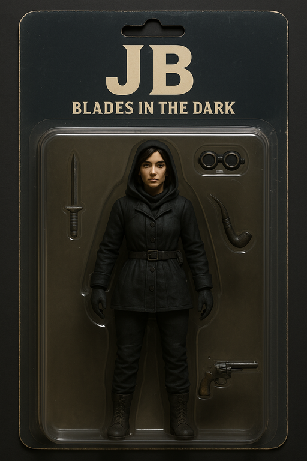

# "JB" Jonathan Bach

{ align=left }

- **Name:** Jonathan Bach
- **Alias:** JB
- **Look:** N/A
- **Heritage:** N/A
- **Background:** N/A
- **Vice:** N/A
- **Friends:** N/A
- **Rivals:** N/A

An academic who recently became a criminal.
Wants to figure out why ghosts can't rest after death.

## Action Figure

/// caption
Limited edition action figure
///
