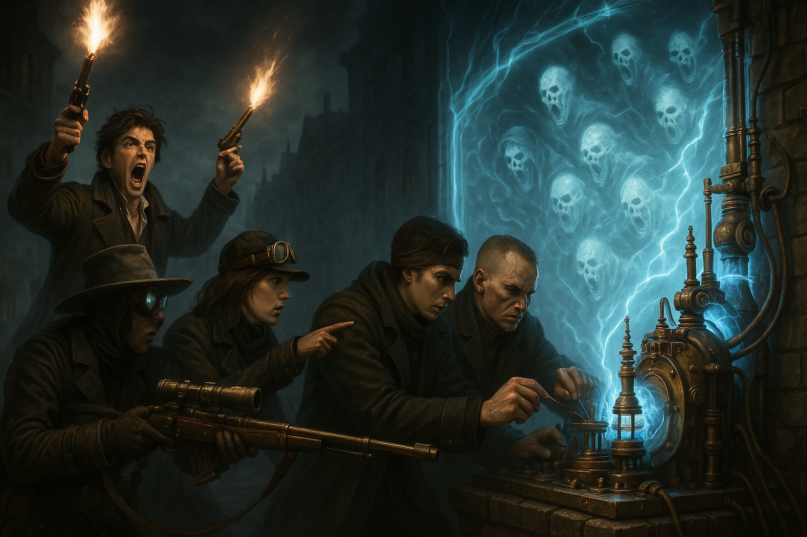
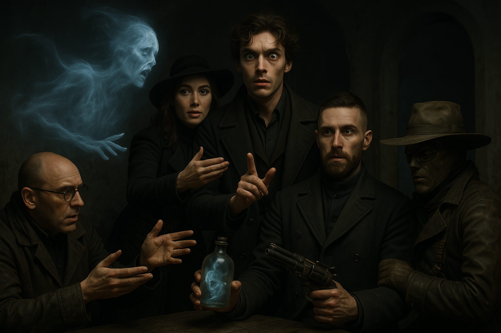
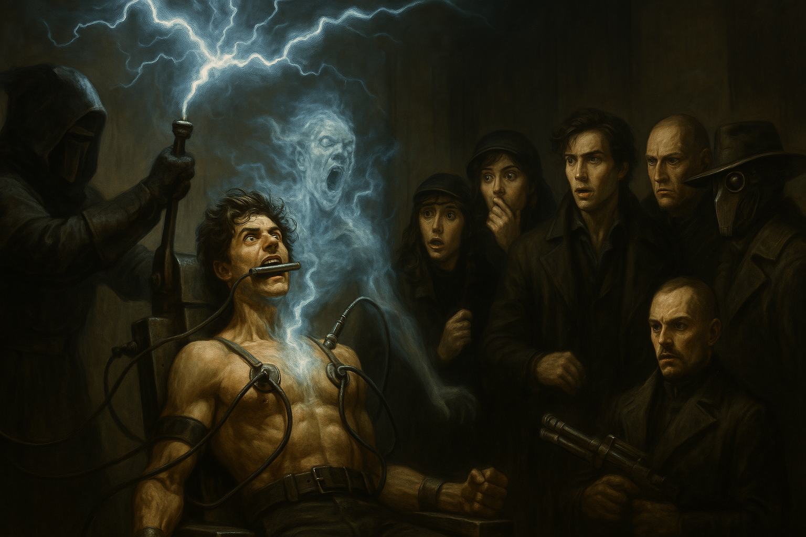
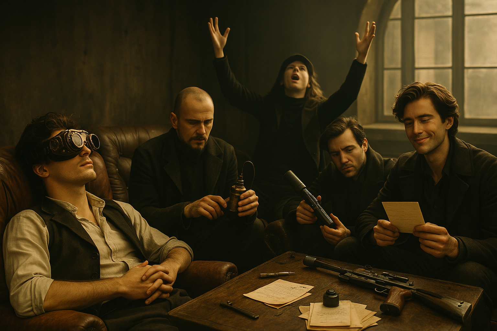

# Strong Spirits

We're at war with the [Spirit Wardens](spirit-wardens.md) and trying to find a way to end it.

<!-- more -->

The [Spirit Wardens](spirit-wardens.md) have quite a few enemies, but they're all pretty strong.

{{ characters.vesper.link }} has a prostitute friend who works with high end clientele.
She will see what she can find out about them.

Maybe we can improve relations by dealing with a troublesome spirit?
We can force a spirit into a spirit bottle using a spiritbane charm.
We talk to Fitz and are able to borrow one.

We travel to the edge of the city where {{ characters.jb.link }} can get us through the barrier keeping spirits out into the [Death Lands](death-lands.md).

## Plan

- **Plan:** Transport
- **Detail:** go outside the barrier to get a spirit and put it in the bottle, then take it to Bellweather Crematorium
- **Engagement Roll:** {{ d6_rolls([1, 2, 2]) }}

## Score

- we start going home to home searching
- there are valuables laying about, we start collecting them
- this attracts the attention of multiple spirits
- two spirits apear before us
- we make a quick plan to catch them
    - {{ characters.jb.link }} tries to toss the spirit rune at them
    - {{ characters.jackal.link }} will try to catch them in the bottle
    - {{ characters.vesper.link }} distracts the spirits
    - {{ d6_rolls([3, 1, 1]) }}
    - the spiritbane charm pushed one of the spirits into {{ characters.jackal.link }} and he's possessed
- {{ characters.jackal.link }} takes the spirit bottle and smashes it on the ground
- the other spirit comes floating towards {{ characters.echo.link }}
    - {{ characters.echo.link }} studies the spirit and tries to ward it off with another spiritbane charm
    - {{ d6_rolls([5, 4, 6]) }}
- {{ characters.vesper.link }} tries to convince the spirit to leave {{ characters.jackal.link }}
    - "We'll take you places that you've never seen"
    - spirit flows out of {{ characters.jackal.link }} into {{ characters.vesper.link }}
    - another spirit appears "I want to go too!"
    - {{ characters.vesper.link }}'s voice sounds different: "Lead the way!"
- {{ characters.vesper.link }} flashes back and we come up with a blinking code to communicate if possessed
    - tries to get {{ characters.hex.link }} to take us to the crematorium
- {{ characters.jackal.link }} tries to use a spirit anchor to bind a spirit to some furniture
    - {{ d6_rolls([3, 6, 6, 4]) }} critical success
    - forces the spirit into a homemade spirit bottle
- we head back towards the barrier
    - have an eerie feeling of attracting more attention
    - around `20` spirits are following us, `100` ft away
    - the barrier is `200` ft
    - we make a run for it
- {{ characters.jackal.link }} surveys the fence to see if it's possible to repair it
    - {{ d6_rolls([4, 2, 3]) }}
    - there's something wrong with one of the towers and he can fix it, but it will take time
- {{ characters.hex.link }} has electroplasmic bullets and wants to shoot some ghosts
    - {{ characters.jb.link }} tries to distract the spirits
    - {{ d6_rolls([4, 4, 2, 2]) }}
    - shoots up the lead spirit that was following us
    - the others are still pursuing
- {{ characters.jackal.link }} tinkers with the barrier
    - {{ d6_rolls([1, 5, 2]) }}
    - repairs the barrier

- we approach the crematorium
- {{ characters.echo.link }} tries to get the spirit following into the spirit bottle
    - devil's bargain: spirit looks like his spurned lover, will make them more angry
    - {{ d6_rolls([1, 5, 2]) }}
    - spirit gets into the bottle, but the [Spirit Wardens](spirit-wardens.md) will take the bottle
    - {{ characters.echo.link }} won't be able to use `Arcane Implements` on the next score

- {{ characters.hex.link }} knocks on the door
    - we're their enemy, so `6` heavily armored men come out
    - {{ characters.jackal.link }} asks the [Spirit Wardens](spirit-wardens.md) to help with the possessed {{ characters.vesper.link }}
- [Spirit Wardens](spirit-wardens.md) drag {{ characters.vesper.link }} inside, and we follow them in
    - they strap {{ characters.vesper.link }} into a machine that looks like its for electro shock therapy

- {{ characters.vesper.link }} attunes to try to fight the spirit
    - {{ d6_rolls([1, 6, 3]) }} reduces from level `2` harm to level `1`
    - {{ characters.vesper.link }} again uses resolve to fight the spirit
    - {{ d6_rolls([2, 4]) }}

## Payoff

- crew earns {{ coin(5) }} from wandering outside the barrier, or {{ coin(1) }} each
- crew earns {{ reputation(6) }} Reputation
- add {{ heat(3) }}
    - {{ heat(2) }} for shooting guns off
    - {{ heat(1) }} for being at war
- {{ experience(0)}} Crew XP
- Faction status
    - Faction `+0`

## Entanglements

- {{ d6_rolls([2, 4], lowest=True) }} one of our customers or contacts will switch allegiances
    - Red Sashes got ahold of [Melvir](melvir.md)

## Vices

- nobody overindulges

## Downtime

- {{ characters.echo.link }}
    - sends apology letters to spurned lover
    - indulges vice
- {{ characters.hex.link }}
    - consorts with bluecoats to remove {{ heat(3) }}
    - stars a long-term project to make a sniper rifle silencer
- {{ characters.jackal.link }}
    - starts a long-term project to work on securing our lair
    - consort with bluecoats to mislead about our hideout location {{ heat(1) }}
- {{ characters.jb.link }}
    - surveys for a better doctor
    - indulges vice
- {{ characters.vesper.link }}
    - indulges vice
    - spread positive rumors among past prison contacts to remove {{ heat(1) }}

## Crew Advancement

- {{ coin(8) }} for `steady` - `+1` max stress
    - {{ coin(3) }} {{ characters.jackal.link }}
    - {{ coin(2) }} {{ characters.echo.link }}
    - {{ coin(1) }} {{ characters.hex.link }}
    - {{ coin(1) }} {{ characters.jb.link }}
    - {{ coin(1) }} {{ characters.vesper.link }}
- spend `2` upgrades to acquire a cohort
    - rooks `Ghost Fang Pack`
        - loyal, tenacious
        - wild, principled
    - we're tier `1` now!
