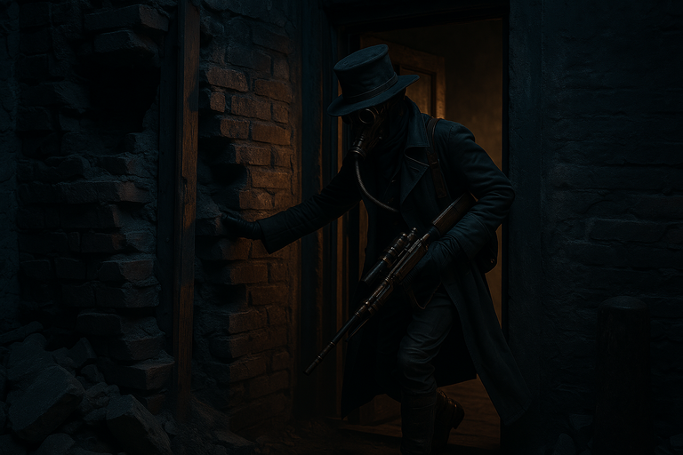
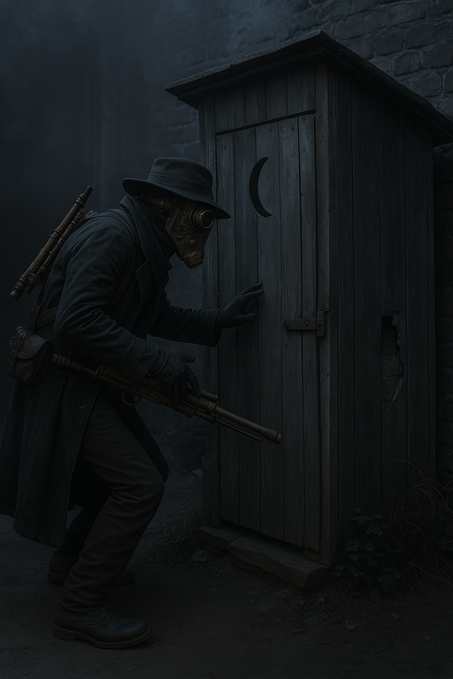

# Hex Confronts Melvir

{{ characters.hex.link }} goes looking for [Melvir](melvir.md) to show him what happens when you cross [Bella's Boyz](bellas-boyz.md).
{{ characters.hex.link }} approaches his apartment and the lock is broken.

<!-- more -->

- {{ characters.hex.link }} listens and watches until [Melvir](melvir.md) goes outside to use the outhouse, and then confronts him.

- [Melvir](melvir.md) says the [Red Sashes](red-sashes.md) threatened to hurt his family if he works for us again.
- At least the [Red Sashes](red-sashes.md) pay him enough that his family can eat.
- [Melvir](melvir.md) is afraid the [Red Sashes](red-sashes.md) will find out {{ characters.hex.link }} was here and hurt his family.
- [Melvir](melvir.md) didn't want to work with the [Red Sashes](red-sashes.md) but needed the money.
- {{ characters.hex.link }} tells [Melvir](melvir.md) that he knows where he lives now, and someday he will ask for a favor.
