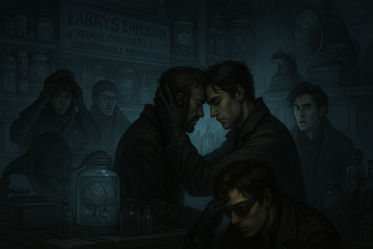
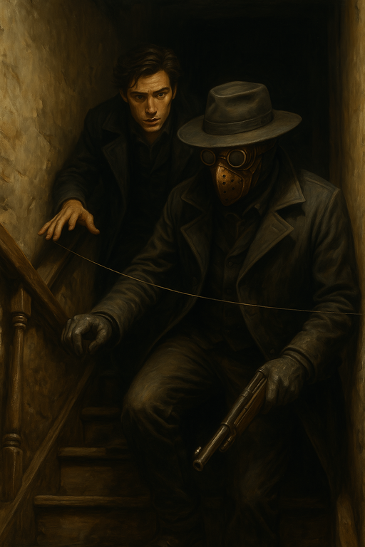
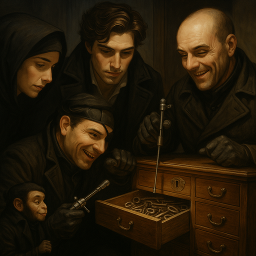
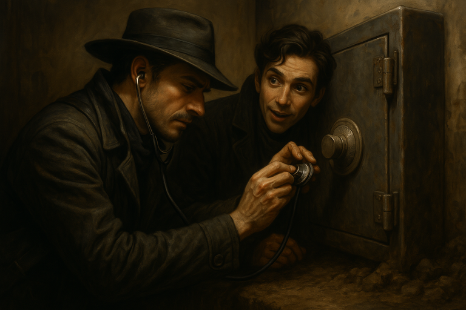
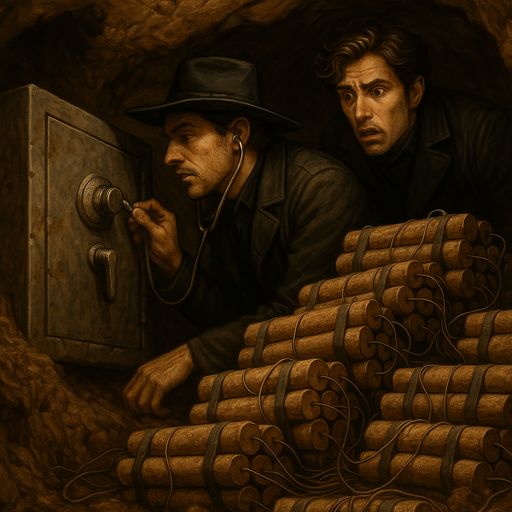
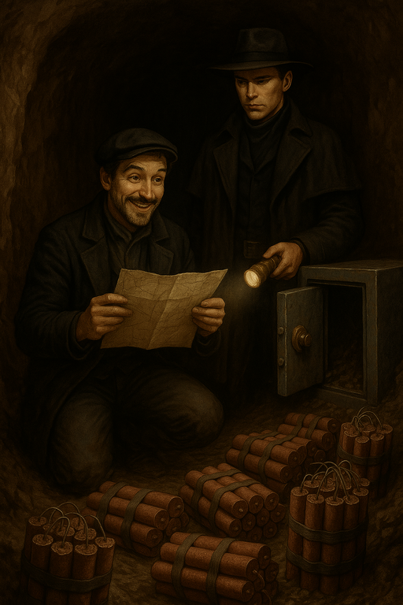
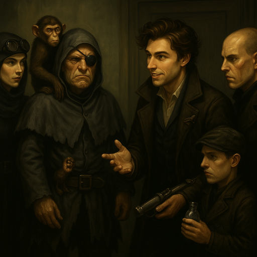

# Scarcely Safe Drop

[The Wraiths](wraiths.md) do covert rooftop drops of luxury items.
We should be able to steal one and use the proceeds to increase our claims.

<!-- more -->

We learned of a drop to the roof of Larry's Medical Goods.
A map showing the locations of leviathans to hunt is likely in the building as well.
We case the place and meet Larry.

## Plan

- **Plan:** Stealth
- **Detail:** infiltrate Larry's Medical Goods
- **Engagement Roll:** {{ d6_rolls([6, 4, 4, 5, 6]) }}

## Score

- {{ characters.vesper.link }} attunes to try to find a clear way through
    - {{ d6_rolls([2, 3]) }}
    - senses ghosts throughout the building
    - they aren't aware of us but seem to be patrolling
    - [The Wraiths](wraiths.md) might employ ghosts as guards
    - ghosts feel his presence and are more on edge now

/// caption
Hex Supports Vesper Attuning
///

- {{ characters.vesper.link }} attunes a second time to learn more
    - {{ characters.hex.link }} supports
    - takes a devil's bargain
        - any time we'd use this drop, we take {{ stress(2) }}
    - {{ d6_rolls([2, 6, 3, 1]) }}
    - we know a location, but not sure if it's the drop, keys, or map
- {{ characters.hex.link }} and {{ characters.echo.link }} go downstairs
    - gently brush into trip wires and somehow avoid setting off the trap

/// caption
Hex and Echo Find a Trip Wire
///

- {{ characters.echo.link }} uses a lamp to study the wires
    - there are many of them
    - {{ characters.hex.link }} helps
    - {{ characters.echo.link }} pushes himself
    - {{ d6_rolls([6, 6, 3]) }}
    - {{ characters.echo.link }} understands the mechanism and also gains some insight into the building's defenses
    - get additional die on rolls

- {{ characters.vesper.link }} {{ characters.jb.link }}, and {{ characters.jackal.link }} go upstairs
    - they try to survey the ghost patrols to look for a pattern
        - group action with {{ characters.vesper.link }} as leader
        - {{ characters.jackal.link }} {{ d6_roll(6) }}
        - {{ characters.jb.link }} {{ d6_rolls([6, 1], lowest=True) }} {{ stress(1) }} for {{ characters.vesper.link }}
        - {{ characters.vesper.link }} {{ d6_rolls([4, 6]) }}
    - find a desk with papers strewn about and many locked drawers
        - {{ characters.jackal.link }} tries to break in with lockpicks from burglary gear
            - {{ d6_rolls([1, 2, 2]) }}
            - tinkering tools destroyed
        - {{ characters.jackal.link }} uses fine wrecking tools
            - {{ d6_rolls([2, 1, 6]) }}
            - drills out the lock
            - find a bunch of keys in the drawer

/// caption
Jackal Opens a Drawer Full of Keys
///

- {{ characters.hex.link }} and {{ characters.echo.link }} continue to explore the basement
    - it's really damp and dark down here
    - find a free-standing safe sunk into the mud
    - there's a tunnel out that goes on for further than we can see with lanterns

/// caption
Hex Listens to the Safe Lock
///

- {{ characters.hex.link }} uses a stethoscope to listen to the safe dial
    - hears more clicks than expected, might be a trap

/// caption
Hex and Echo See the Trap
///

- {{ characters.echo.link }} tries to disarm the bomb
    - flashback to learn more about past [Wraith](wraiths.md) traps
    - {{ characters.echo.link }} pushes himself
    - {{ characters.hex.link }} assists
    - {{ d6_rolls([4, 3, 6, 5]) }}
    - trap disarmed
- {{ characters.hex.link }} opens the safe
    - inside we find a map of leviathan locations

/// caption
Hex and Echo Find a Map
///

- {{ characters.vesper.link }} {{ characters.jb.link }}, and {{ characters.jackal.link }} reach the roof
    - a man dressed like one of [The Wraiths](wraiths.md) is pacing the rooftop, guarding the drop

/// caption
[Ricky](ricky.md), the rooftop guard
///

- {{ characters.vesper.link }} tries to sway the guard
    - his name is [Ricky](ricky.md)
    - try to figure out what his cut is from the operation, maybe we'll offer more?
    - {{ d6_rolls([1, 6, 4, 5]) }}
    - [Ricky](ricky.md) says tunnels connect to canals
    - someone must have found the tunnels and come up that way
    - {{ characters.jackal.link }} paid [Ricky](ricky.md) off with {{ coin(1) }}

/// caption
Convincing [Ricky](ricky.md) to Give Us the Drop
///

- we can get {{ coin(2) }} when we do espionage or sabotage

## Payoff

- crew earns {{ coin(6) }}
    - {{ coin(6) }} leviathan map
- crew earns {{ reputation(2) }} Reputation
    - [The Wraiths](wraiths.md) were {{ tier(2) }}
    - we didn't keep the operation completely quiet since we sold the map
        - they don't know it was us, but they might find out later
- add {{ heat(0) }} Heat
    - the operation was smooth and quiet
    - not on hostile turf
    - we didn't kill anybody
- {{ experience(4) }} Crew XP
    - {{ experience(2) }} successful robbery/espionage
    - {{ experience(1) }} for [The Wraiths](wraiths.md) above our rep
    - {{ experience(1) }} for strange things aligning with our faction's goals
- Faction status
    - no changes

## Entanglements

- {{ d6_rolls([2, 2], lowest=True) }}
    - one of our members causes trouble due to a flaw
    - [Ghostfang Pack](ghostfang-pack.md) got into trouble since we didn't give them anything to do
        - they're `weak` now

## Vices

- nobody overindulges

## Downtime

- {{ characters.echo.link }}
    - reduces {{ stress(3) }}
    - sends spurned lover some nice chocolates accompanied with poetry
        - relationship repaired before she turned us in
    - spends {{ coin(1) }} trains `prowess`
- {{ characters.hex.link }}
    - reduces {{ stress(1) }}
    - trains `prowess`
    - spends {{ coin(1) }} to work on sniper rifle silencer
- {{ characters.jackal.link }}
    - continues tinkering with long-term project to secure our lair
    - and does it again
- {{ characters.jb.link }}
    - continues looking for a better doctor
    - and does it again
- {{ characters.vesper.link }}
    - reduces {{ stress(2) }}
    - reduces {{ stress(4) }}
