# The Mangled Match

[Bella's Boyz](bellas-boyz.md) are looking for another claim to expand our territory.
we took a claim in the docks from the foghounds before.
The [Gray Cloaks](gray-cloaks.md) operate mostly in [Charterhall](charterhall.md).
We hear [Lord Strangford](lord-strangford.md) is willing to pay for evidence the [Gray Cloaks](gray-cloaks.md) stole from the [Blue Coats](blue-coats.md).

<!-- more -->

- {{ characters.echo.link }} receives a letter demanding {{ coin(1) }}
    - {{ characters.echo.link }} pays
    - the rest of the crew don't press him to explain
- [Jeren](jeren.md) is able to give us a tip on how to find the [Gray Cloaks](gray-cloaks.md) and where the evidence might be hidden
    - look for [Schlomo](schlomo.md) at the fight
- [Nyryx](nyryx.md) finds out about a bare-knuckle boxing match that we could use as a distraction
    - [Nyryx](nyryx.md) asks {{ characters.vesper.link }} not to come to her with something so low-brow in the future

## Plan

- **Plan:** **Social**
- **Detail:** [Jeren](jeren.md) helps us find the evidence
- **Engagement Roll:** {{ d6_rolls([6, 3, 3]) }}
    - bold, daring since there are many [Gray Cloaks](gray-cloaks.md) at the party

## Score

- there are 2 big bouncers at the door
    - we make it inside without anyone noticing

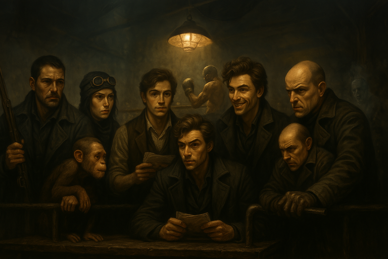
/// caption
Bella's Boyz at the Fight
(Ricky and monkey are there in spirit)
///

- a crowd is around the ring
    - they're not all that into the fight
    - a bookie asks us for bets on `2:1` welterweight **Toothless Joe** vs. **Hairy Sam**
        - {{ characters.jb.link }} puts a {{ coin(1) }} on the underdog **Toothless Joe**
- {{ characters.echo.link }} surveys the place for [Schlomo](schlomo.md)
    - {{ characters.jb.link }} helps
    - {{ d6_rolls([4, 1]) }}
    - {{ characters.echo.link }} tries to discreetly ask about [Schlomo](schlomo.md)
    - totally flubs the conversation, people are watching us more closely now
- the featherweight match ends and the match we bet on begins

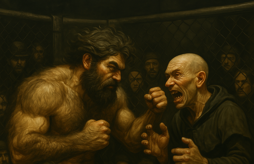
/// caption
**Hairy Sam** vs. **"Toothless" Joe**
///

- {{ characters.vesper.link }} attunes to see if a ghost can help **Toothless Joe**
    - {{ characters.hex.link }} helps block others seeing {{ characters.vesper.link }} as he talks to himself
    - find a ghost and convince them to mess with **Hairy Sam**
    - {{ d6_rolls([6, 3, 5]) }}
- crowd gathers, this fight seems more interesting
    - **Hairy Sam** gets distracted in the middle of the fight
    - **Toothless Joe** joe knocks him out
    - crowd goes nuts due to the surprise
    - {{ characters.jb.link }} collects {{ coin(1) }}
- crowd gets thicker as the heavyweight match approaches
    - **Little Birdies** vs. **Damn Monkeys** `10:1`
    - we don't bet on this one

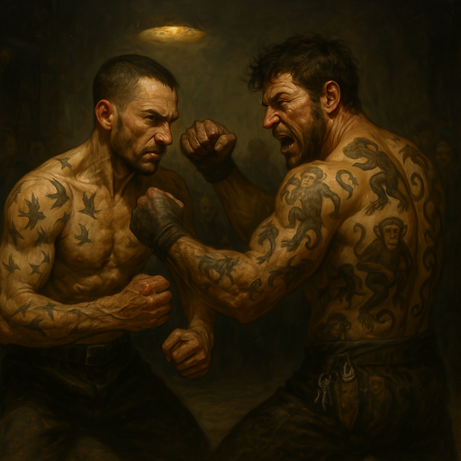
/// caption
**Little Birdies** vs. **Damn Monkeys**
///

- {{ characters.vesper.link }} tries to convince the guards that it's ok to watch the fight
    - {{ characters.hex.link }} assists
    - {{ d6_rolls([4, 5, 3, 6]) }}
    - {{ characters.vesper.link }} will have to stay and watch the door
- {{ characters.jb.link }}, {{ characters.echo.link }}, and {{ characters.jackal.link }} go inside
- {{ characters.echo.link }} asked ahead of time to make sure there were no countermeasures on the safe
    - there's nothing
- {{ characters.jackal.link }} uses fine wrecking tools
    - {{ characters.echo.link }} assists
    - {{ d6_rolls([2, 3, 2]) }}

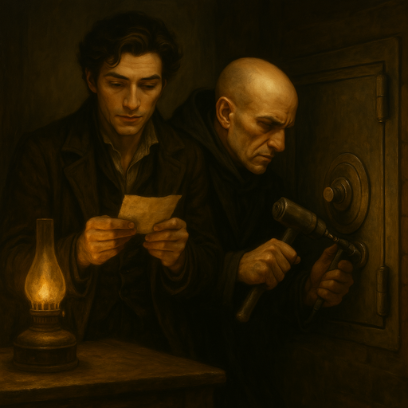
/// caption
{{ characters.jackal.link }} Works on the Safe
///

- first round of the match is over
    - sound of drill binding in the safe cuts through the quiet between rounds
    - guards notice and head for the door
- {{ characters.vesper.link }} tries to convince the guards that it was nothing
    - {{ d6_rolls([2, 1, 4, 1, 3]) }}
    - {{ characters.hex.link }} warns us the guards are coming
- {{ characters.jackal.link }} resumes drilling
    - {{ characters.jb.link }} assists
    - {{ d6_rolls([5, 5, 4]) }}
    - {{ characters.jackal.link }} gets the safe open and we steal the evidence

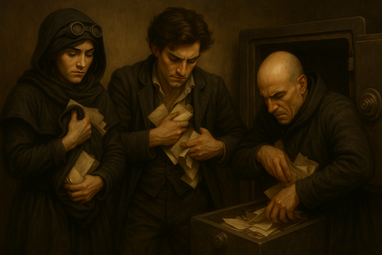
/// caption
{{ characters.jb.link }}, {{ characters.echo.link }}, and {{ characters.jackal.link }} Steal the Evidence
///

- {{ characters.jb.link }} uses ghost veil to sneak out with {{ characters.echo.link }} and {{ characters.jackal.link }}
    - pulls us through the wall onto the street
    - a pair of goats pulling a cart runs over {{ characters.jackal.link }}
    - {{ characters.jackal.link }} resists and gains {{ stress(3) }}
    - {{ characters.jackal.link }} twists his ankle, gaining a level `1` harm

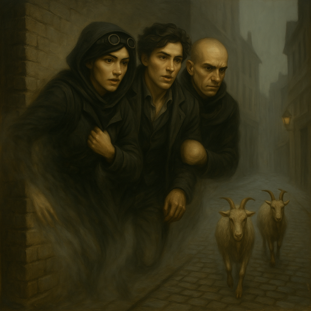
/// caption
{{ characters.jb.link }}, {{ characters.echo.link }}, and {{ characters.jackal.link }} use **Ghost Veil** but run into a pair of goats (pulling a cart)
///

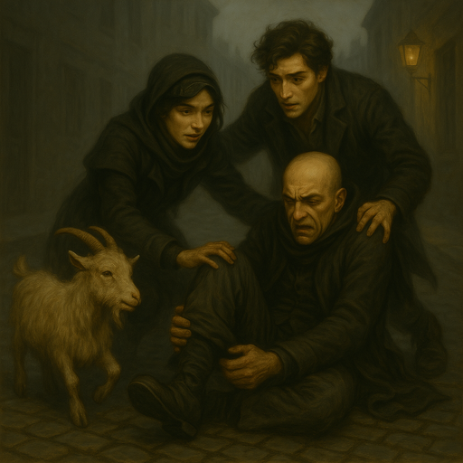
/// caption
{{ characters.jackal.link }} Injured his Ankle
///

- the brute guards push past {{ characters.vesper.link }} and {{ characters.hex.link }}
    - the guards realize they've been robbed
    - {{ characters.vesper.link }} and {{ characters.hex.link }} disappear
    - group roll to escape with `prowl`
        - {{ characters.vesper.link }} {{ d6_rolls([6, 6, 4]) }} using `sway`
        - {{ characters.hex.link }} {{ d6_rolls([5, 3]) }}

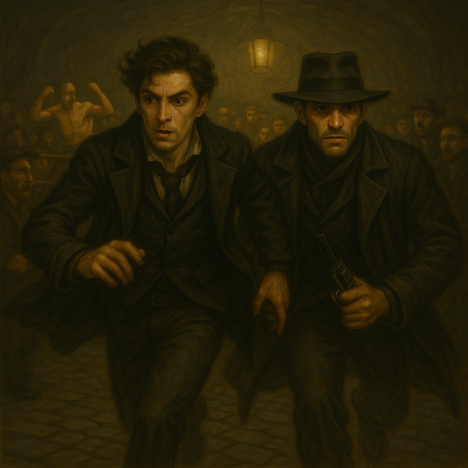
/// caption
{{ characters.vesper.link }} and {{ characters.hex.link }} Escape
///

- [Ghostfang Pack](ghostfang-pack.md) followed us to the fight (See [Entanglements](#entanglements))

## Payoff

- crew earns {{ reputation(3) }} Reputation
    - [Gray Cloaks](gray-cloaks.md) are {{ tier(2) }}
- add a claim for some turf
- add {{ heat(2) }} Heat
    - contained with standard exposure
- {{ experience(0)}} Crew XP
- Faction status
    - [Gray Cloaks](gray-cloaks.md) `-2`

## Entanglements

- {{ d6_rolls([4, 2], lowest=True) }}
    - [Ghostfang Pack](ghostfang-pack.md)
        - riled up the crowd
        - attracted attention of the [Gray Cloaks](gray-cloaks.md)
        - decreased our rep

## Vices

- nobody overindulges

## Downtime

- {{ characters.echo.link }}
    - indulges vice, relieves {{ stress(6) }} which overindulges
        - add an entanglement at {{ heat(2) }}
            - {{ characters.jb.link }}'s friend [Telda](telda.md) gets picked up by the [Blue Coats](blue-coats.md)
            - gain {{ heat(2) }}
    - bribes a [Blue Coat](blue-coats.md) to release [Telda](telda.md) before she talks
        - sway {{ d6_roll(5) }}
        - removes {{ heat(2) }}

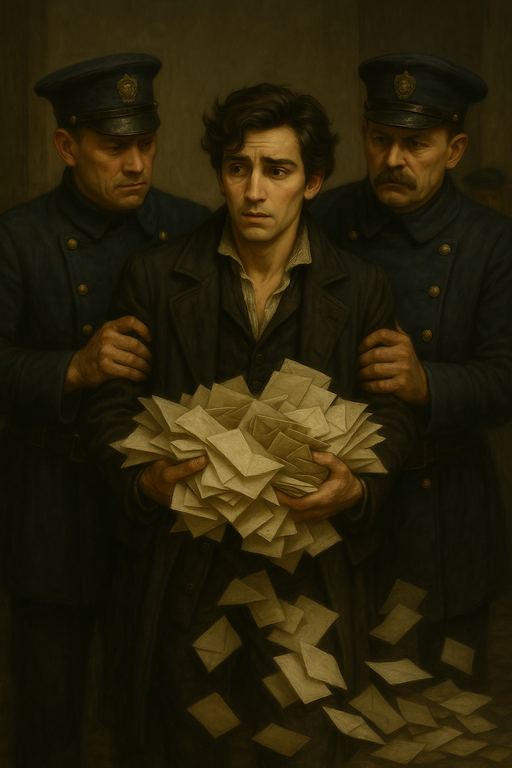
/// caption
{{ characters.echo.link }} Captured by the [Blue Coats](blue-coats.md)
///

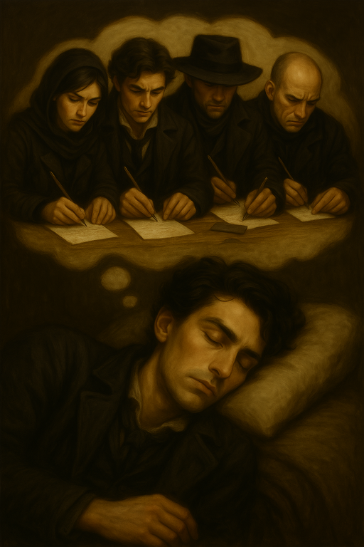
/// caption
{{ characters.echo.link }} Dreams of the Whole Crew Helping the Cyphers
///

- {{ characters.hex.link }}
    - trained playbook advancement
        - shooting range
    - indulges vice, relieves {{ stress(4) }}

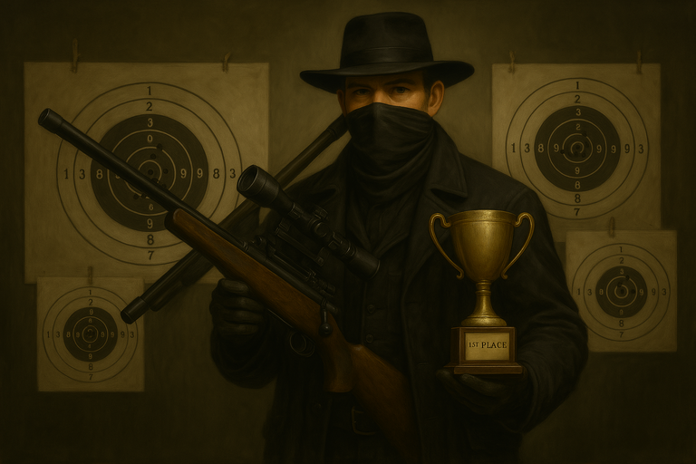
/// caption
{{ characters.hex.link }} Wins a Shooting Trophy
///

- {{ characters.jackal.link }}
    - indulges vice, relieves {{ stress(3) }}
    - indulges vice, relieves {{ stress(2) }}

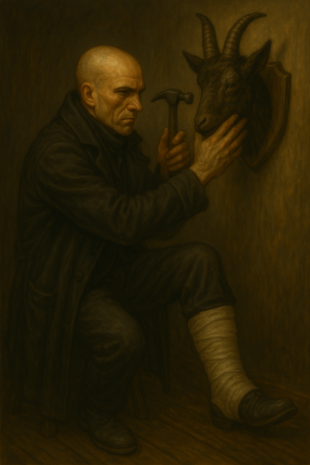
/// caption
{{ characters.jackal.link }} Takes Care of the Goat
///

- {{ characters.jb.link }}
    - finds a new doctor - [Finklebottom](finklebottom.md)
        - new doctor is now {{ tier(1) }}
    - goes to the doctor to fix broken rib
        - still not fixed
    - pays {{ coin(1) }} to try to fix the rib again
        - reduced to a level 1 harm

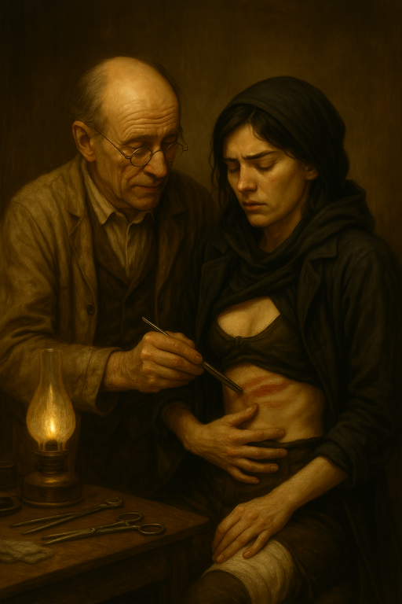
/// caption
[Dr. Finklebottom](finklebottom.md) Fixes {{ characters.jb.link }}'s Rib
///

- {{ characters.vesper.link }}
    - indulges vice, relieves {{ stress(4) }}
    - sway [Lord Strangford](lord-strangford.md) to reduce heat
        - {{ d6_rolls([2, 6, 4]) }}
        - removes {{ heat(3) }}
