# The Last Dregs

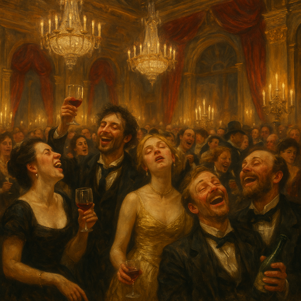
/// caption
The [Ghostfang Pack](ghostfang-pack.md) hosted a party in [Whitecrown](whitecrown.md).
///

[Lady Freyla](lady-freyla.md) was one of the richest to attend.
At first, [Bella's Boyz](bellas-boyz.md) considered stealing some of her legendary wine collection.
Then, one of her competitors offered a substantial reward to ruin her reputation instead.

<!-- more -->

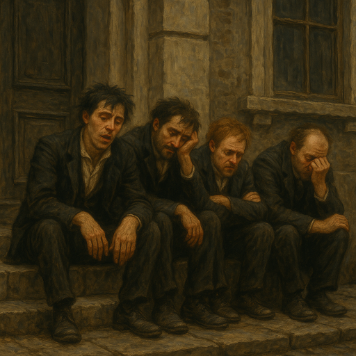
/// caption
After the party, the [Ghostfang Pack](ghostfang-pack.md) is too bit hung over to help with the score.
///

[Bella's Boyz](bellas-boyz.md) have a surprising number of connections to [Lady Freyla](lady-freyla.md):

- She testified against {{ characters.vesper.link }}.
- She beat {{ characters.hex.link }} in a sommolier competition at Da Club and he wants revenge.
- She's rumored to have a bottle of wine that {{ characters.echo.link }}'s spurned lover desires: Velorium Sanctum – "Sunless Bloom" Icewine
- She is {{ characters.jb.link }}'s former girlfriend

{{ characters.hex.link }} is at Da Club, talking to the bartender about fine wines.
He convinces the bartender to let him sample a small glass of Le Mongoose.
It's an extremely expensive wine, even samples cost `$5/ml`.

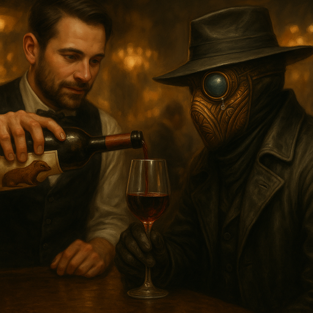
/// caption
{{ characters.hex.link }} Samples Le Mongoose, a Fine Wine
///

The bartender mentions a buyer is coming later to pick up the cask of Le Mongoose, worth {{ coin(100) }}.
The buyer is a competitor of [Lady Freyla](lady-freyla.md).
Some time later, {{ characters.vesper.link }} sees a man approach with high collar and hood.
Vesper bumps into him.
"Careful, this is very expensive!"

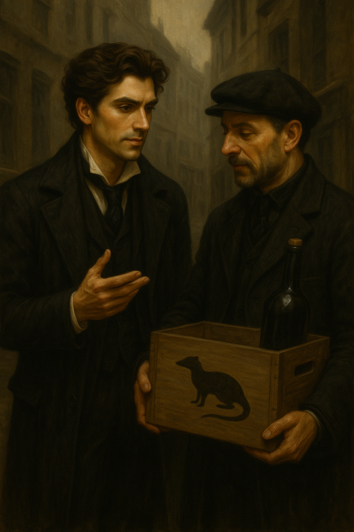
/// caption
{{ characters.vesper.link }} and the Wine Buyer
///

Vesper thinks the buyer looks vaguely familiar.
The buyer mentions that it would be a shame if [Lady Freyla](lady-freyla.md) lost the next sommolier competition.
Vesper offers to remove a competing wine from [Lady Freyla](lady-freyla.md)'s collection.
The buyer offers {{ coin(40) }} for us to ruin her best wine without leaving a trace.
If we're detected, we will get only {{ coin(10) }}.
The buyer offers to have someone meet us at Da Club to help with changing the wine's flavor profile.

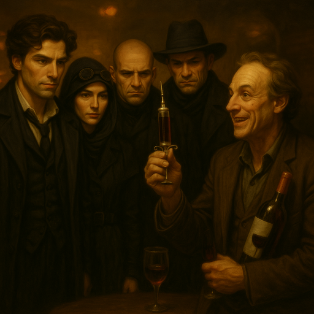
/// caption
[Bella's Boyz](bellas-boyz.md) meet [Frenchy](frenchy.md)
///

[Bella's Boyz](bellas-boyz.md) are introduced to [Frenchy](frenchy.md), the wine fixer.
He says it will be much easier to alter the wine instead of swapping whole bottles.
[Frenchy](frenchy.md) pulls out a long needle and waves it around.
He wants to use this syringe to inject something into [Lady Freyla](lady-freyla.md)'s expensive wines.
We need to get him into the wine cellar, but we're a bit nervous about how conspicuous he is with waving the syringe around.

## Plan

- **Plan:** Deception
- **Detail:** Pose as a wine delivery crew
- **Engagement Roll:** {{ d6_rolls([1, 1]) }}

## Score

- [Lady Freyla](lady-freyla.md) is at the door, and we would recognize anyone except {{ characters.jackal.link }}
    - we need a way to sneak past
- {{ characters.jb.link }} goes to the door to try to distract [Lady Freyla](lady-freyla.md)

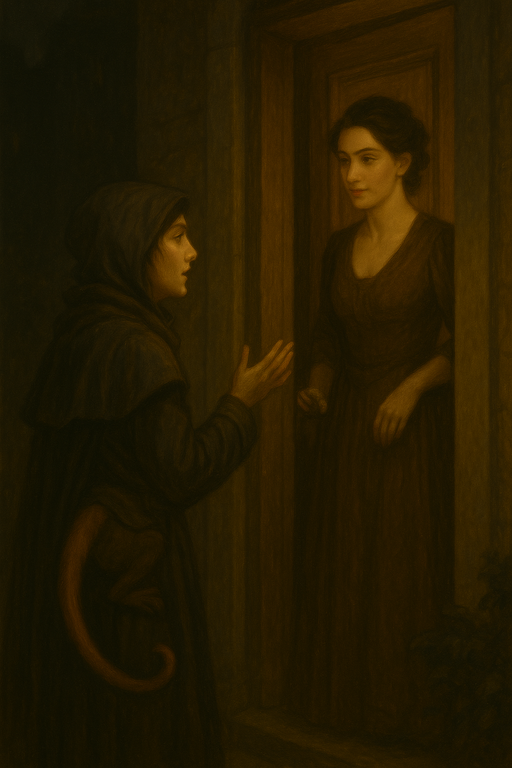
/// caption
{{ characters.jb.link }} at [Lady Freyla](lady-freyla.md)'s Door
///

- [Lady Freyla](lady-freyla.md) answers the door
    - seems annoyed, says {{ characters.jb.link }} is wierd and why are they there
    - JB wants to know if she heard the songs

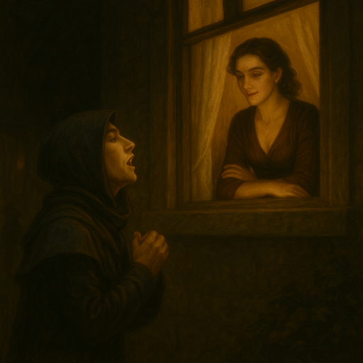
/// caption
Flashback: {{ characters.jb.link }} Sang to [Lady Freyla](lady-freyla.md)
///

- we try to deliver the wine
    - {{ characters.jb.link }} keeps up the distractions
- {{ characters.jb.link }} brought a monkey for [Lady Freyla](lady-freyla.md) as a gift
    - but, [Lady Freyla](lady-freyla.md) is allergic to monkeys
    - monkey starts playing some cymbals
    - {{ characters.jb.link }} thought she was only allergic to gerbils

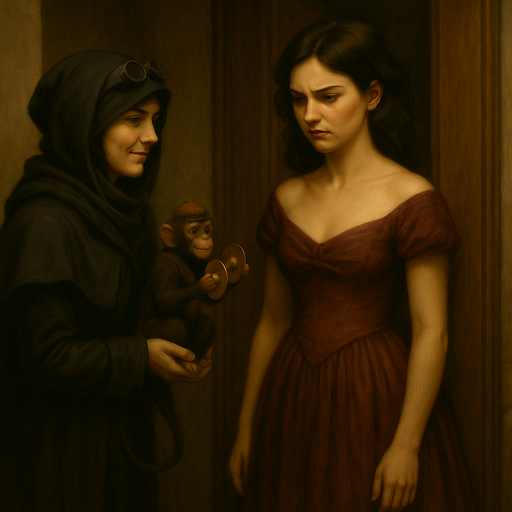
/// caption
Monkey plays the cymbals, [Lady Freyla](lady-freyla.md) is not amused.
///

- {{ characters.jb.link }} tries to express their love in the form of dance
    - {{ characters.jackal.link }} assists with beatbox
    - {{ characters.jb.link }} pushes
    - {{ d6_rolls([5, 4, 5]) }}
    - monkey clangs the cymbals
    - {{ characters.jackal.link }} does some solid beatboxing
    - {{ characters.jb.link }} does some impressive dancing
    - on the last dance move, {{ characters.jb.link }} lands on the monkey's tail
    - monkey runs away

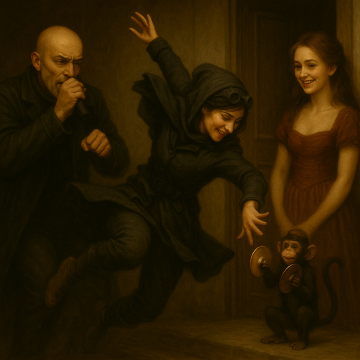
/// caption
{{ characters.jb.link }}, {{ characters.jackal.link }}, and a Monkey Serenade [Lady Freyla](lady-freyla.md)
///

- others are able to sneak past
- [Lady Freyla](lady-freyla.md) asks {{ characters.jb.link }} to leave her alone
    - tells {{ characters.jb.link }} to find a ghost partner because that's what they're into
- Crew heads down into the wine cellar
    - [Frenchy](frenchy.md) starts getting to work with the syringe

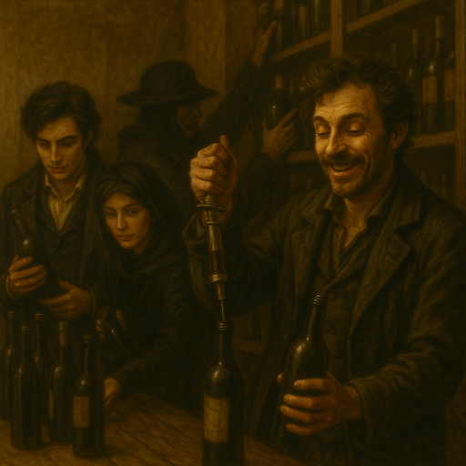
/// caption
[Frenchy](frenchy.md) Uses Syringe on Wine
///

- survey group roll to find various bottles of wine
    - {{ d6_roll(6) }}
    - we find the bottles
- [Frenchy](frenchy.md) is getting a bit over excited
    - accidentally pokes himself with syringe
    - tries to explain what to do to {{ characters.vesper.link }} while he still can
- we start trying to take over
    - [Frenchy](frenchy.md) starts singing

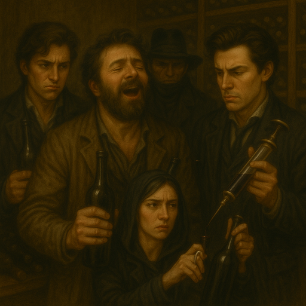
/// caption
[Frenchy](frenchy.md) Sings While the Crew Works
///

- {{ characters.hex.link }} tries to shut [Frenchy](frenchy.md) up
    - devils bargain - sea shanties trigger hex to get violent
        - hex declines
    - {{ d6_rolls([1, 1, 6]) }}
    - {{ characters.hex.link }} knocked out [Frenchy](frenchy.md)

- [Lady Freyla](lady-freyla.md) pokes her head in the door to ask if everything is alright
    - She says "I don't mind singing, but that song..."
- we finish altering the wine with the syringe
- now we need to get out without [Lady Freyla](lady-freyla.md) recognizing us
    - {{ characters.vesper.link }} disguises himself

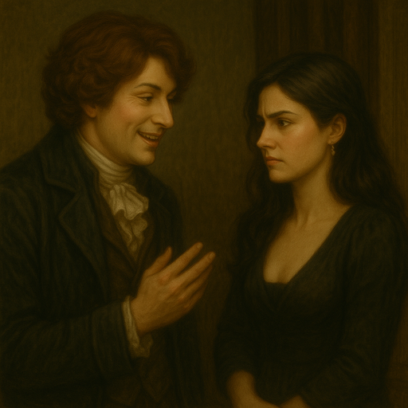
/// caption
{{ characters.vesper.link }} (Disguised) Talking to [Lady Freyla](lady-freyla.md)
///

- [Lady Freyla](lady-freyla.md) says she will pay later via the usual method
    - we say that [Frenchy](frenchy.md) bonked his head

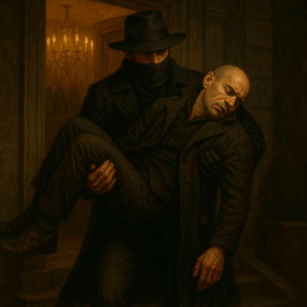
/// caption
{{ characters.hex.link }} Carries [Frenchy](frenchy.md)
///

- [Frenchy](frenchy.md) comes around later and arranges for us to meet his employer at Da Club
- figure in the corner with sack of coin
    - light faintly flickering on his face
    - {{ characters.vesper.link }} approaches
    - slides over a sack of {{ coin(40) }}

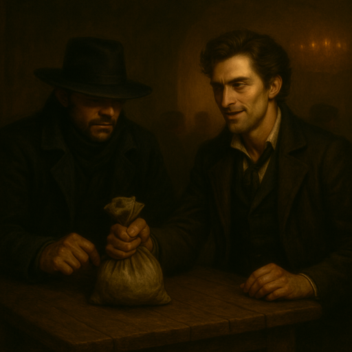
/// caption
{{ characters.vesper.link }} Accepts Payment for the Operation
///

- As [Frenchy](frenchy.md)'s employer leaves, {{ characters.hex.link }} catches a glimpse and thinks he might be his brother

<table markdown>
<tr markdown>
<td markdown>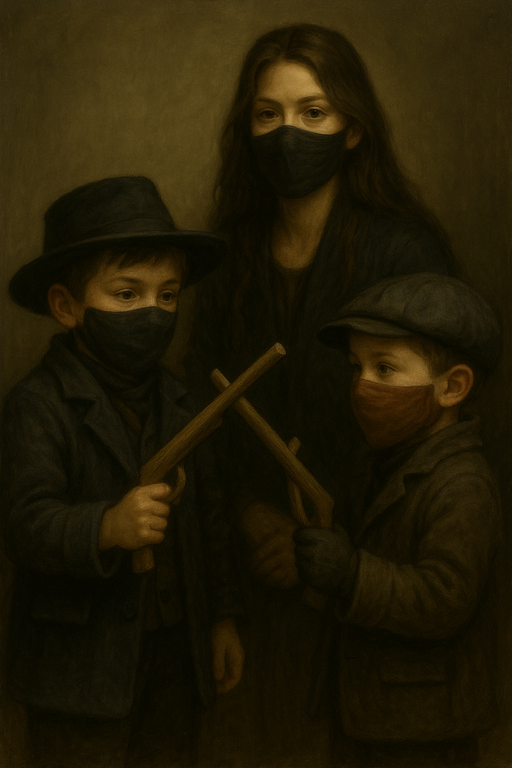</td>
<td markdown>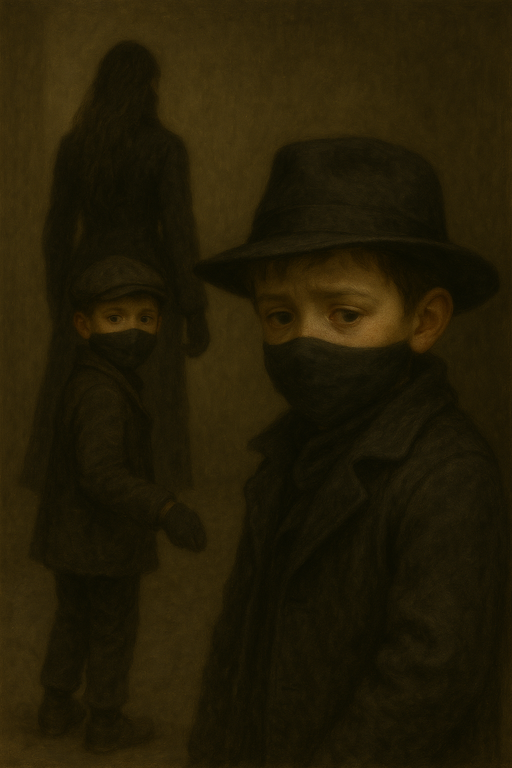</td>
<td markdown>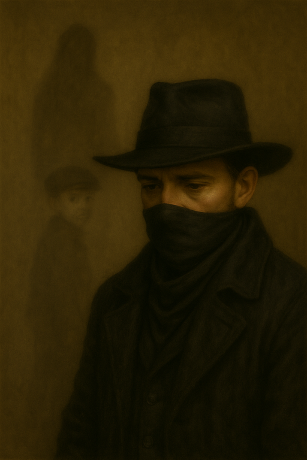</td>
</tr>
</table>
/// caption
{{ characters.hex.link }} Remembers His Mother and Brother
///

- [Frenchy](frenchy.md) said we did good work, but doesn't want to repeat the experience

## Payoff

- crew earns {{ coin(40) }}
    - each get {{ coin(8) }}
- crew earns {{ reputation(0) }} Reputation
    - quiet operation
- add {{ heat(3) }} Heat
    - {{ heat(1) }} well-connected target
    - {{ heat(2) }} entanglements
- {{ experience(1) }} Crew XP
    - {{ experience(1) }} sabotage
- Faction status
    - no changes

## Entanglements

- {{ d6_rolls([3, 6]) }}
- [Blue Coats](blue-coats.md) grab someone related to the crew - vice purveyor or friend
    - [Spirit Wardens](spirit-wardens.md) pick up [Salia](salia.md), {{ characters.vesper.link }}'s purveyor
- fortune roll {{ d6_rolls([4, 2]) }}
    - {{ heat(2) }} [Spirit Wardens](spirit-wardens.md) figure out [Salia](salia.md)'s connection to [Bella's Boyz](bellas-boyz.md)

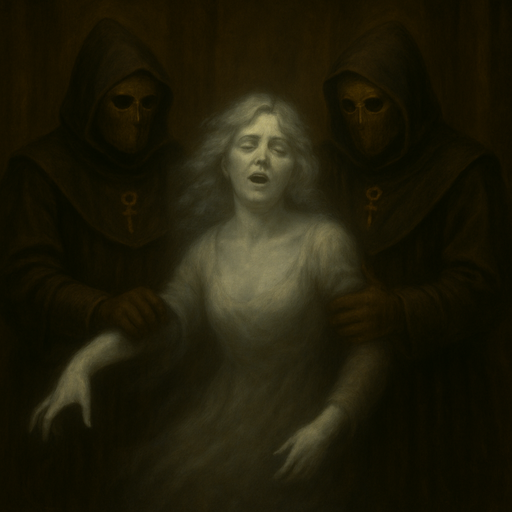
/// caption
[Spirit Wardens](spirit-wardens.md) Take [Salia](salia.md)
///

## Vices

- {{ characters.echo.link }} overindulges
    - `tapped` - needs a new vice purveyor

## Downtime

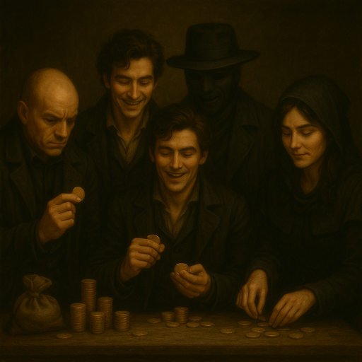
/// caption
[Bella's Boyz](bellas-boyz.md) Count the Money
///

- [Bella's Boyz](bellas-boyz.md) buy a carraige for {{ coin(10) }}
    - {{ coin(2) }} {{ characters.vesper.link }}
    - {{ coin(3) }} {{ characters.jackal.link }}
    - {{ coin(1) }} {{ characters.hex.link }}
    - {{ coin(2) }} {{ characters.jb.link }}
    - {{ coin(2) }} {{ characters.echo.link }}

- [Bella's Boyz](bellas-boyz.md) upgrade steady for {{ coin(10) }} to allow an extra stress
    - {{ coin(2) }} {{ characters.vesper.link }}
    - {{ coin(3) }} {{ characters.jackal.link }}
    - {{ coin(2) }} {{ characters.hex.link }}
    - {{ coin(1) }} {{ characters.jb.link }}
    - {{ coin(2) }} {{ characters.echo.link }}

- {{ characters.echo.link }}
    - looking for a new vice purveyor - 6 segment clock
        - was intrigued by betting on the fight
        - [Sgt Velk](sgt-velk.md) is {{ characters.echo.link }}'s new vice purveyor
    - {{ d6_roll(4) }} `2` segments
    - {{ d6_roll(5) }} `2` segments
    - {{ coin(1) }} `1` segment
    - {{ coin(1) }} `1` segment
    - {{ coin(1) }} train `Prowess`

<table markdown>
<tr markdown>
<td markdown>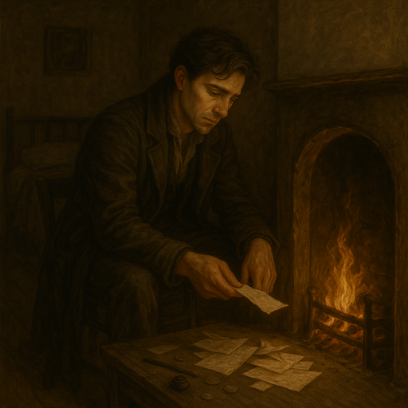</td>
<td markdown>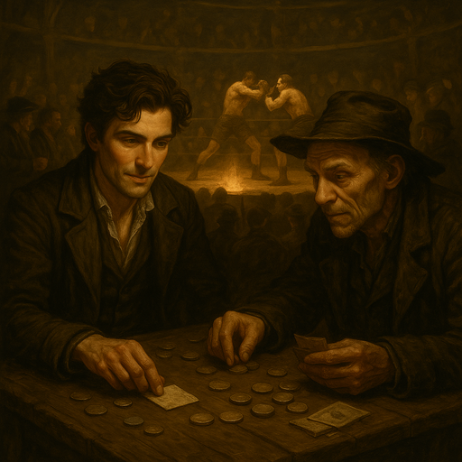</td>
</tr>
</table>
/// caption
{{ characters.echo.link }} is done with the [Cyphers](cyphers.md) and gambles at the fighting pits.
///

- {{ characters.hex.link }}
    - reduce {{ heat(1) }} by surveying [Blue Coats](blue-coats.md)
    - works on silencer {{ d6_rolls([5, 6]) }}
    - spends {{ coin(1) }} to train `Insight`
    - trains {{ coin(1) }} to train `Prowess`
- {{ characters.jackal.link }}
    - secure lair with tinker {{ d6_rolls([5, 6]) }}
    - trains `Prowess`
- {{ characters.jb.link }}
    - healing with [Dr. Finklebottom](finklebottom.md) {{ d6_roll(4) }}
    - relieve {{ stress(4) }} {{ d6_rolls([4, 4], lowest=True) }}
- {{ characters.vesper.link }}
    - indulged vice
    - reduces {{ heat(3) }} with {{ d6_rolls([2, 6, 1]) }}
    - spends {{ coin(1) }} to indulge vice {{ d6_rolls([3, 5], lowest=True) }}
    - spends {{ coin(1) }} to train `Insight`
