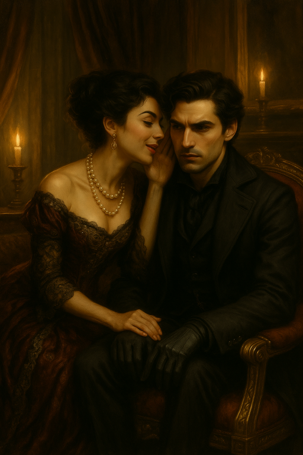

# JB Visits Lady Freyla

The day after [The Last Dregs](2025-04-25-last-dregs.md) score ...

{{ characters.jb.link }} brings candy, wine, and recorded tunes to visit [Lady Freyla](lady-freyla.md).

After some persistent knocking, no one comes to answer the door.
Using a portable phonograph, {{ characters.jb.link }} plays a song professing love for her.

/// caption
{{ characters.jb.link }} plays phonograph for [Lady Freyla](lady-freyla.md).
///

<!-- more -->

A minute goes by, and still [Lady Freyla](lady-freyla.md) doesn't answer.
The neighbors start shouting at {{ characters.jb.link }} to turn off the music.

/// caption
{{ characters.jb.link }} frustrated when [Lady Freyla](lady-freyla.md) doesn't answer.
///

{{ characters.jb.link }} uses ghost veil to go through the front door.

There are chairs pulled out and papers arranged such that [Lady Freyla](lady-freyla.md) was likely here recently, but she is nowhere in sight.
Turning off the phonograph, {{ characters.jb.link }} continues looking around.

{{ characters.jb.link }} checks upstairs but doesn't find anything.
Down in the wine cellar, [Lady Freyla](lady-freyla.md) is sprawled on the floor.
She is cold to the touch and has no pulse.

/// caption
{{ characters.jb.link }} discovers [Lady Freyla](lady-freyla.md)'s body.
///

{{ characters.jb.link }} hears crows outside.
Fearing the [Spirit Wardens](spirit-wardens.md) may arrive soon to destroy [Lady Freyla](lady-freyla.md)'s ghost, {{ characters.jb.link }} tries to attune to the ghost field and contact her.
Unfortunately, there's no sign of her ghost nearby.

The [Spirit Wardens](spirit-wardens.md) make noise outside as they approach the house.

> {{ characters.jb.link }}: [Lady Freyla](lady-freyla.md)? if you can hear me, I can't see you. Follow me out of the house away from the [Spirit Wardens](spirit-wardens.md).

{{ characters.jb.link }} sneaks away, trying to avoid the [Spirit Wardens](spirit-wardens.md).
The [Spirit Wardens](spirit-wardens.md) see a figure running away, but probably couldn't tell it was {{ characters.jb.link }}.

/// caption
{{ characters.jb.link }} runs away from the [Spirit Wardens](spirit-wardens.md). (They weren't really this close)
///

{{ characters.jb.link }} is convinced that [Lady Freyla](lady-freyla.md)'s ghost wasn't there.

Since the [Spirit Wardens](spirit-wardens.md) found [Lady Freyla](lady-freyla.md) body and {{ characters.jb.link }} was making such a racket before, [Bella's Boyz](bellas-boyz.md) are going to have to answer some questions.
Add {{ heat(4) }}.

## Vesper Investigates

{{ characters.vesper.link }} asks [Nyryx](nyryx.md) if she heard anything about [Lady Freyla](lady-freyla.md).

/// caption
[Nyryx](nyryx.md) whispers rumors of [Lady Freyla](lady-freyla.md)'s death to Vesper
///

> [Nyryx](nyryx.md): There are rumors that she was killed by a bottle of tainted wine.
> Maybe it was an accident, but maybe it was murder.
> Someone was seen sneaking out of the house when the [Spirit Wardens](spirit-wardens.md) arrived.
> There was a second wine glass, so she may have had a visitor.

/// caption
{{ characters.jb.link }} remembers seeing a second wine glass.
///

/// caption
[Bella's Boyz](bellas-boyz.md) ask {{ characters.hex.link }} if he killed [Lady Freyla](lady-freyla.md).
///
