# Shell Game

We're looking for something small and expensive that we can steal.
[Rolan Wott](rolan-wott.md) will be hosting a party soon for his daughter's 16th birthday.
His prized possession is a Fabergé egg.
[Bella's Boyz](bellas-boyz.md) go to see [Fitz](fitz.md) for tools and materials, and {{ characters.jackal.link }} makes a replica of the egg.

<table markdown>
<tr markdown>
<td markdown>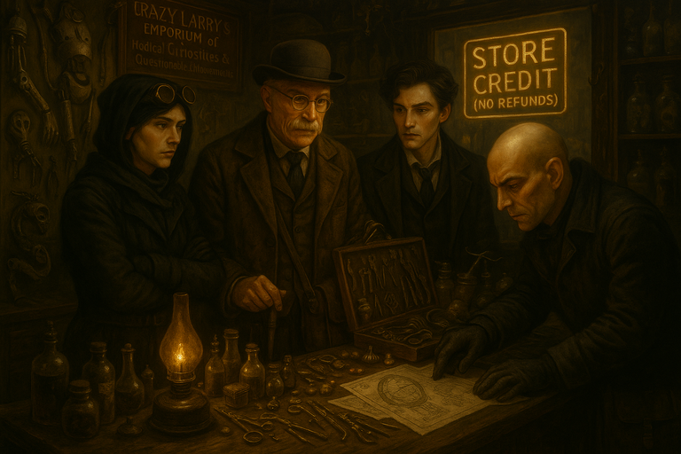</td>
<td markdown>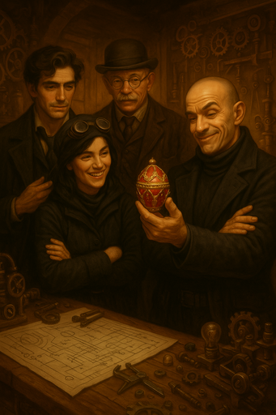</td>
</tr>
</table>
/// caption
{{ characters.jackal.link }}, {{ characters.jb.link }}, and {{ characters.vesper.link }} go to [Fitz](fitz.md) for supplies.
{{ characters.jackal.link }} makes a replica of the egg.
///

<!-- more -->

Commander Bowmore might be at this party ({{ characters.jackal.link }} wants to sabotoge the government).

{{ characters.vesper.link }} gets his name on the list of party attendees.
[Jennah](jennah.md) helps everyone else pose as servants for the party.

## Plan

- **Plan:** Social
- **Detail:** {{ characters.vesper.link }} will confront [Rolan Wott](rolan-wott.md) while everyone else poses as servants and swaps the egg
- **Engagement Roll:** {{ d6_rolls([3, 4, 1]) }}
    - `+1` the operation is bold and daring
    - `+1` {{ characters.vesper.link }} confronting [Rolan Wott](rolan-wott.md) hits him where he's weakest
    - `+1` {{ characters.echo.link }}'s friend [Jennah](jennah.md) knows other servants at the party
    - `-1` due to heavy [Blue Coats](blue-coats.md) presence in [Brightstone](brightstone.md)

{{ characters.vesper.link }} shows up late due to clothing difficulties.

## Score

- {{ characters.echo.link }}, {{ characters.jackal.link }}, and {{ characters.jb.link }} are working hard preparing food and drinks in the kitchen
    - it's not going poorly, but still the head chef is yelling at everyone

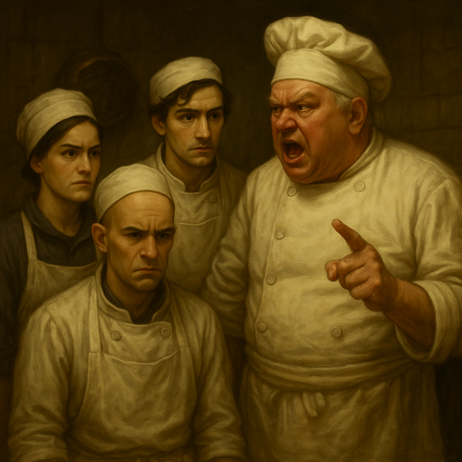
/// caption
Head chef yelling at {{ characters.echo.link }}, {{ characters.jackal.link }}, and {{ characters.jb.link }} in the kitchen
///

- need a way to sneak out and look for the egg
- {{ characters.echo.link }} makes up a story about having to make some cocktails for a demanding rich person's group
    - {{ d6_rolls([6, 6, 3]) }}
    - {{ characters.echo.link }} makes an amazing cocktail that the guest love

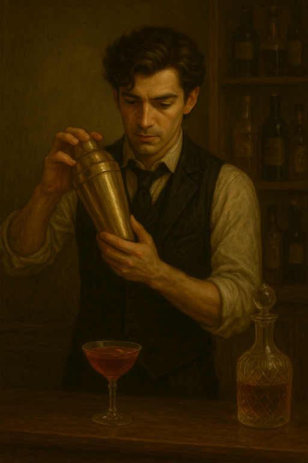
/// caption
{{ characters.echo.link }} making a cocktail
///

- the head chef is really impressed with the cocktail
    - {{ characters.echo.link }} feels like the chef owes him a favor
    - {{ characters.echo.link }} will be able to sneak away and find the egg

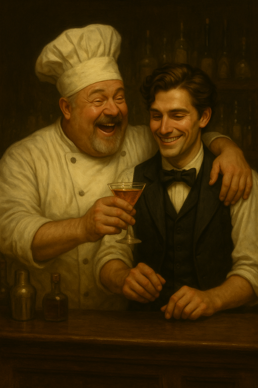
/// caption
Head chef praises {{ characters.echo.link }} for making an delicious cocktail
///

- {{ characters.hex.link }} and {{ characters.vesper.link }} arrive at the party
    - using the new goat powered carraige that [Bella's Boyz](bellas-boyz.md) acquired
    - guests are singing happy birthday
    - [Rolan Wott](rolan-wott.md)'s daughter is blowing out the candles

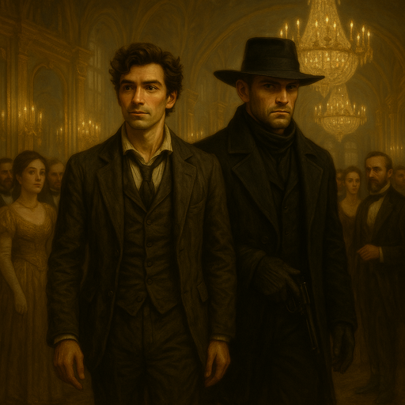
/// caption
{{ characters.vesper.link }} and {{ characters.hex.link }} arrive at the party
///

- {{ characters.vesper.link }} attunes to see if he can find a ghost
    - tries to get the ghost to knock the cake over into [Rolan Wott](rolan-wott.md)'s daughter
    - instead, the ghost pushes her face into the top of the cake
    - she starts screaming that her birthday is ruined and asking who did it

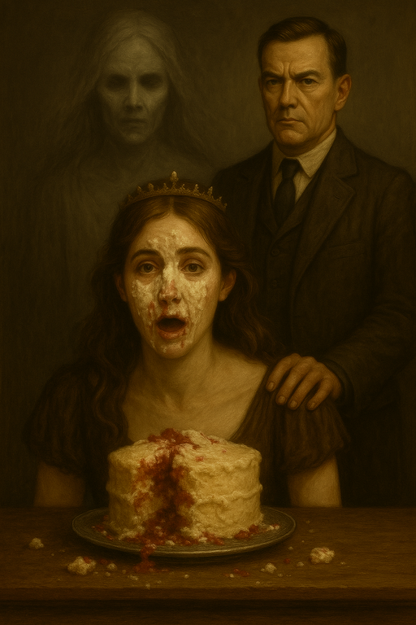
/// caption
[Rolan Wott](rolan-wott.md)'s daughter, upset after having her face shoved in the cake
///

- [Rolan Wott](rolan-wott.md) looks around the room, looking for someone to blame
- {{ characters.vesper.link }} tells his story of [Rolan Wott](rolan-wott.md)
    - devil's bargain - everyone will remember {{ characters.vesper.link }}'s wrinkled clothes
    - {{ characters.vesper.link }} pushes himself
    - {{ characters.hex.link }} encourages him
    - {{ d6_rolls([2, 4, 2, 3, 1, 2]) }}
    - {{ characters.hex.link }} slaps {{ characters.vesper.link }} for encouragement but it startles him

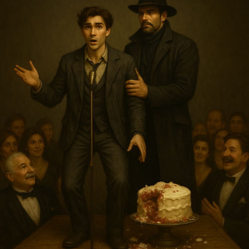
/// caption
{{ characters.vesper.link }} gives a speech about [Rolan Wott](rolan-wott.md), with {{ characters.hex.link }} supporting
///

- {{ characters.jb.link }}, {{ characters.echo.link }}, and {{ characters.jackal.link }} use the distraction to sneak away
    - they reach the egg, but it's protected by electroplasm field

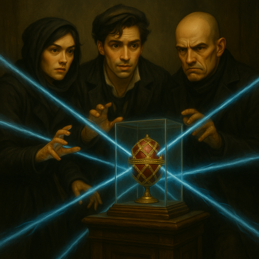
/// caption
{{ characters.jb.link }}, {{ characters.echo.link }}, and {{ characters.jackal.link }} find the Fabergé egg in an electroplasm field
///

- {{ characters.echo.link }}'s architect friend [Augus](augus.md) had provided the plans for the electroplasm field
    - we're able to find a panel with a bunch of pipes carrying electroplasm
- {{ characters.jackal.link }} tries to temporarily disable the electroplasm field with tinkering tools
    - {{ characters.echo.link }} helps
    - {{ characters.jackal.link }} pushes
    - {{ d6_rolls([1, 3, 1, 5]) }}
    - the field goes down

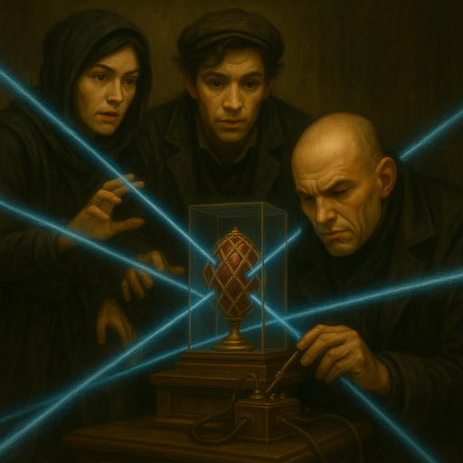
/// caption
{{ characters.jackal.link }} disabling the electroplasm field
///

- {{ characters.jb.link }} swaps the egg
    - as they finish the swap and start to pull away, the field comes back on
    - {{ characters.jb.link }} tries to resist with **Prowess**
        - {{ characters.echo.link }} assists {{ stress(1) }}
        - {{ d6_rolls([1, 3, 4]) }}
        - {{ characters.jb.link }} takes {{ stress(2) }}
    - {{ characters.jb.link }} gets second degree burns from the electroplasm

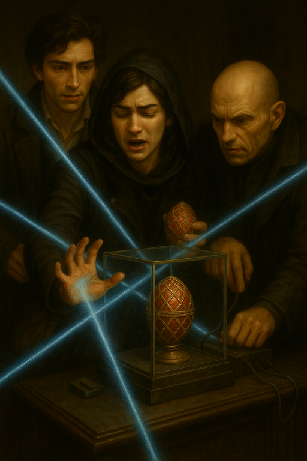
/// caption
{{ characters.jb.link }}'s hand is injured when the electroplasm field suddenly comes back on
///

- we go to return to our posts in the kitchen
- crowd doesn't seem quite as mesmerized as {{ characters.vesper.link }} hoped
- {{ characters.vesper.link }} tries to find another ghost to help distract from the rest of the crew
    - {{ characters.hex.link }} assists
    - {{ d6_rolls([2, 5, 1, 3]) }}
- [Rolan Wott](rolan-wott.md) daughter is upset that her birthday is ruined
    - [Rolan Wott](rolan-wott.md) points at {{ characters.vesper.link }}
    - "You'll rue this day"

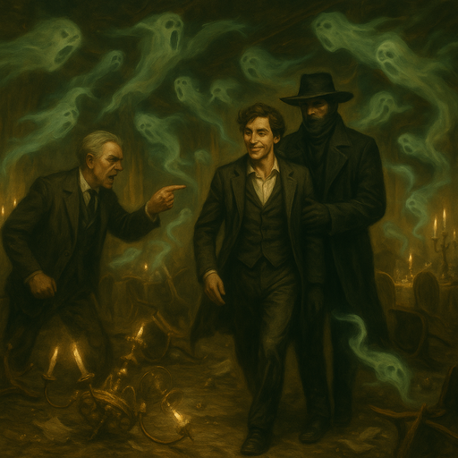
/// caption
[Rolan Wott](rolan-wott.md) shouts at {{ characters.vesper.link }} and {{ characters.hex.link }}
///

- everyone is able to escape
    - but can't help feeling that we'll see [Rolan Wott](rolan-wott.md) again

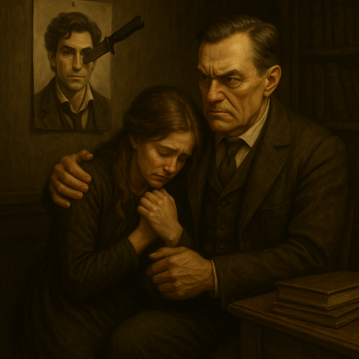
/// caption
[Rolan Wott](rolan-wott.md) vows to take revenge on {{ characters.vesper.link }} for ruining the party
///

- [Bella's Boyz](bellas-boyz.md) find a new fence [Mozzy](mozzy.md) to sell the egg

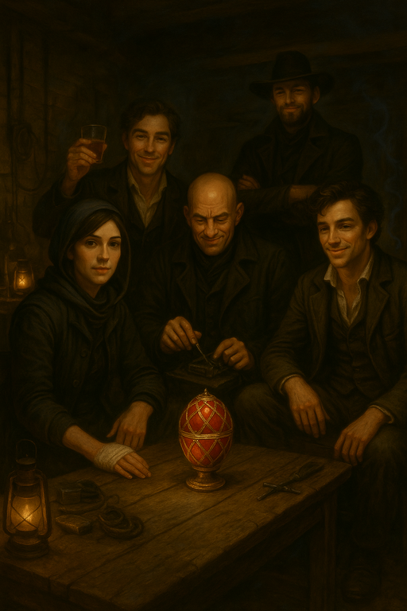
/// caption
[Bella's Boyz](bellas-boyz.md) admire the real Fabergé egg
///

## Payoff

- crew earns {{ coin(10) }}
    - {{ coin(2) }} each
- crew earns {{ reputation(5) }} Reputation
    - {{ reputation(2) }} default
    - {{ reputation(3) }} [Rolan Wott](rolan-wott.md) is {{ tier(4) }}
- add {{ heat(4) }} Heat
    - {{ heat(2) }} contained and standard exposure
    - {{ heat(1) }} high-profile target
    - {{ heat(1) }} hostile turf
- {{ experience(4)}} Crew XP
- Faction status
    - no changes other than [Red Sashes](red-sashes.md) eliminated the [Lampblacks](lampblacks.md)

## Entanglements

- rivals - another faction throws their weight around
    - [Red Sashes](red-sashes.md) eliminated the [Lampblacks](lampblacks.md)

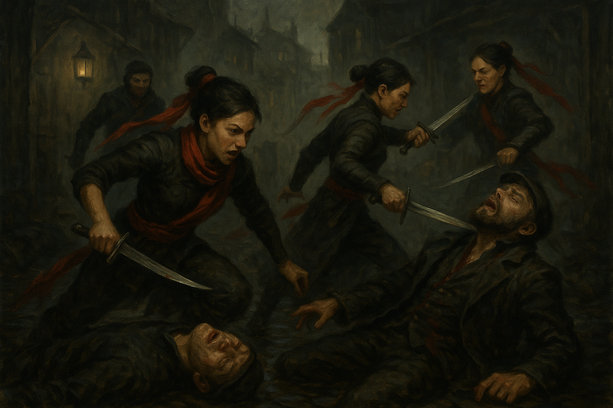
/// caption
[Red Sashes](red-sashes.md) eliminate the last of the [Lampblacks](lampblacks.md)
///

## Vices

- {{ characters.vesper.link }} overindulges
    - brags about his exploits
    - {{ heat(2) }}

## Downtime

- {{ characters.echo.link }}
    - reduce {{ heat(2) }} by consorting with [Jeren](jeren.md) to remove some reports
    - train prowess
    - {{ coin(1) }} train insight
- {{ characters.hex.link }}
    - trains prowess
    - finishes sniper rifle silencer
- {{ characters.jackal.link }}
    - goes to see [Dr. Finklebottom](finklebottom.md) 3 times
        - {{ coin(1) }} for 3rd visit
        - ankle healed

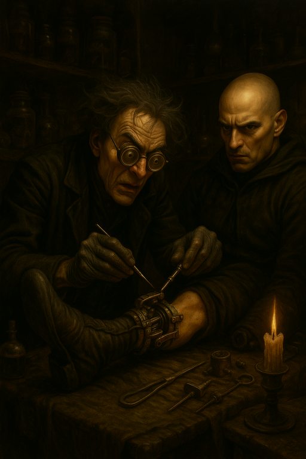
/// caption
[Dr. Finklebottom](finklebottom.md) heals {{ characters.jackal.link }}'s ankle
///

- {{ characters.jb.link }}
    - goes to see [Dr. Finklebottom](finklebottom.md) 3 times
        - {{ coin(1) }} for 3rd visit
        - rib is healed now
        - hand still injured
    - {{ coin(1) }} indulges vice

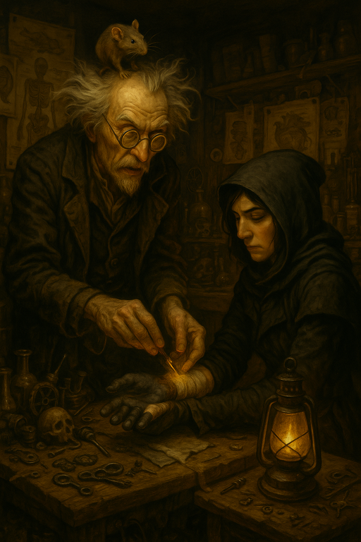
/// caption
[Dr. Finklebottom](finklebottom.md) fixes {{ characters.jb.link }}'s hand (a rat assists)
///

- {{ characters.vesper.link }}
    - goes to see [Dr. Finklebottom](finklebottom.md)
        - still recovering from being in prison before

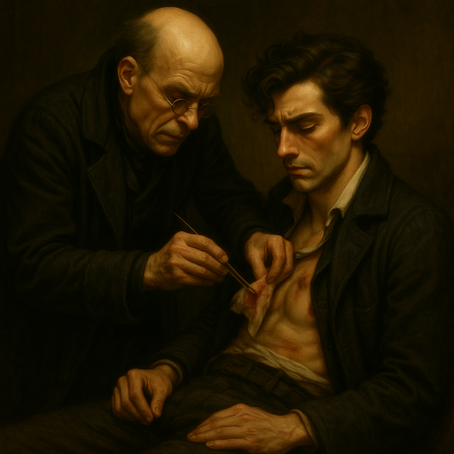
/// caption
[Dr. Finklebottom](finklebottom.md) heals {{ characters.vesper.link }}
///

- we buy a boat for {{ coin(10) }}
    - {{ coin(2) }} each
    - and a boathouse to store supplies
    - it's not fancy
    - can carry our crew and some goods
    - found it in some turf we took from the Foghounds earlier

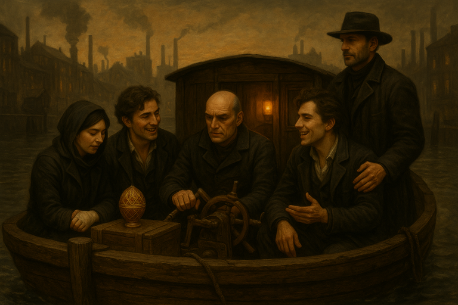
/// caption
[Bella's Boyz](bellas-boyz.md) acquire a barge
///

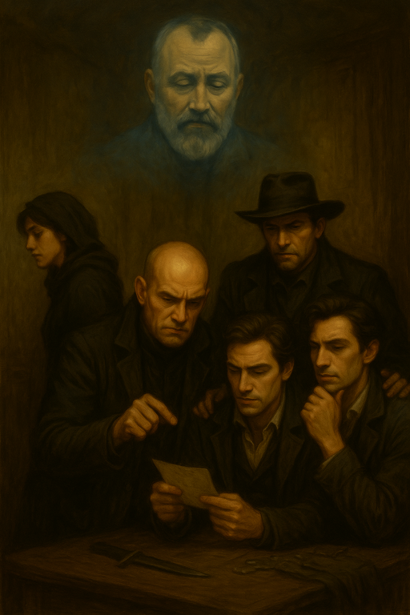
/// caption
[Bella's Boyz](bellas-boyz.md) feel a presence watching over them
///

## Next Time

- need an additional cohort to get the next crew tier
