# Sashes Ashes

It's been a month since the last score.
The [Red Sashes](red-sashes.md) are still spread thin from fighting the [Lampblacks](lampblacks.md).
[Bella's Boyz](bellas-boyz.md) make a deal with the [Crows](crows.md) to exploit their weakness.

<!-- more -->

- {{ characters.vesper.link }} spent a few weeks in jail.
    - paid off guards on entry
    - incarceration roll {{ d6_rolls([4, 1]) }}
        - {{ characters.vesper.link }} keeps his head down and gets out

- [Bella's Boyz](bellas-boyz.md) meed with [Lisa](lisa.md), leader of the [Crows](crows.md)
    - [Lisa](lisa.md) thinks fondly of us since we're allies
    - [Red Sashes](red-sashes.md) seem weak right now, should we make a move to end them?
    - At first, [Lisa](lisa.md) disagrees agree since the [Red Sashes](red-sashes.md) pay tribute to the [Crows](crows.md)
    - {{ characters.hex.link }} mentions that the [Red Sashes](red-sashes.md) might be trying to move up and eliminate the [Crows](crows.md)
    - [Crows](crows.md) will provide weaponry, in exchange we'll give them 20% of the loot

- consider using ghost oil to get into the [Red Sashes](red-sashes.md)' lair
    - they might have a spirit lamp
    - can repel ghosts (people in ghost field are effectively ghosts)

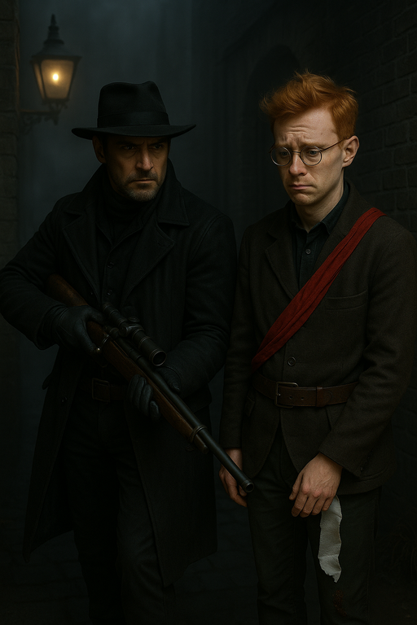
/// caption
{{ characters.hex.link }} visits [Melvir](melvir.md)
///

- {{ characters.hex.link }} goes to see [Melvir](melvir.md) again
    - [Red Sashes](red-sashes.md) had found a weakness in the [Lampblacks](lampblacks.md) and explioted it
    - [Bella's Boyz](bellas-boyz.md) had made the [Red Sashes](red-sashes.md) dislike the [Lampblacks](lampblacks.md)
    - {{ characters.hex.link }} asks [Melvir](melvir.md) if there's something the [Red Sashes](red-sashes.md) might want
        - [Red Sashes](red-sashes.md) might go after the [Crows](crows.md) next
    - [Red Sashes](red-sashes.md) are still spread thin from fighting the [Lampblacks](lampblacks.md)
    - [Melvir](melvir.md) is uncomfortable with still owing {{ characters.hex.link }} a favor
    - [Melvir](melvir.md) draws us a map of the [Red Sashes](red-sashes.md) lair which can help us shut down the spirit lamp.

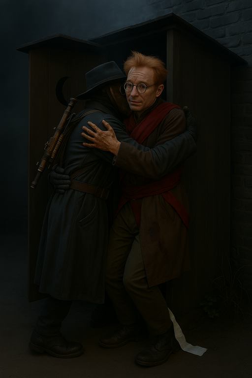
/// caption
Before leaving, {{ characters.hex.link }} embraces the nervous [Melvir](melvir.md)
///

## Plan

- Disable the spirit lamp
- Use ghost oil to sneak in
- Lure the [Red Sashes](red-sashes.md) into the big room and get them all
    - [Ghostfang Pack](ghostfang-pack.md) will help lure
        - Signal them when to get out

- **Plan:** Stealth
- **Detail:** enter using ghost field and ghost oil
- **Engagement Roll:** {{ d6_rolls([3, 3, 5, 1]) }}

## Score

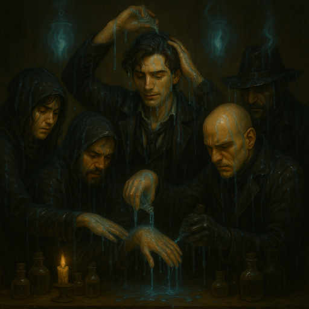
/// caption
[Bella's Boyz](bellas-boyz.md) slather on the ghost oil
///

- [Bella's Boyz](bellas-boyz.md) follow [Melvir](melvir.md)'s map
    - {{ characters.hex.link }} flashes back and asks [Melvir](melvir.md) the location of the spirit lamp {{ stress(1) }}

- {{ characters.echo.link }} and {{ characters.vesper.link }} run down the hall
    - trying to avoid being noticed by some late arrivals at the party
    - try to act like we're already having a great time
    - {{ d6_rolls([5, 3, 2, 2, 3]) }}
    - convince them we're involved in the party
    - end up hanging out longer than we want to keep up appearances

- {{ characters.echo.link }} and {{ characters.vesper.link }} continue
    - see the spirit lamp
    - fire is fueled by a host
    - smells like burnt hair, probably electroplasm fluid
    - {{ characters.echo.link }} approaches the machine for a closer look
    - {{ characters.echo.link }} flashes back to ask [Melvir](melvir.md) for how to disable the alarm
        - {{ characters.vesper.link }} assists
        - devil's bargain - anxiety stays with me, -1d when disabling alarm
        - Finesse {{ d6_rolls([1, 4, 2]) }}
        - Alarm is disabled for only the spirit lamp
    - {{ characters.echo.link }} and {{ characters.vesper.link }} disconned the electroplasm fuel line
        - Finesse {{ d6_rolls([4, 5, 6]) }}
        - spirit lantern light goes out

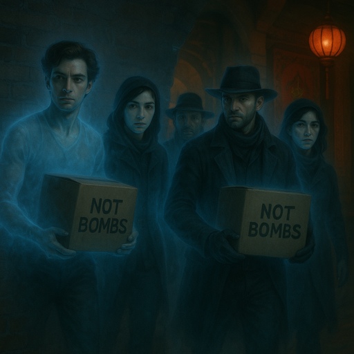
/// caption
[Bella's Boyz](bellas-boyz.md) sneaking bombs into the [Red Sashes](red-sashes.md)' lair
///

- {{ characters.hex.link }}, {{ characters.jb.link }}, and {{ characters.jackal.link }} sense the spirit lantern is out
    - there's a lot of valuable loot in here
    - carry {{ coin(14) }} out between the `3` of them

- {{ characters.jackal.link }} tinkers to set up the bomb
    - {{ characters.jb.link }} assists
    - {{ characters.jackal.link }} pushes himself
    - {{ d6_rolls([6, 1, 1, 5]) }}
    - sucessfully arms the bomb

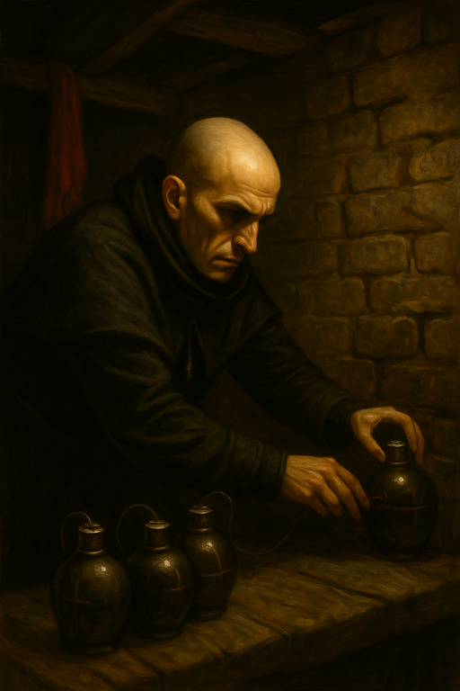
/// caption
{{ characters.jackal.link }} arms the bombs
///

- with limited time, [Bella's Boyz](bellas-boyz.md) can only make `2` trips with loot
    - we take out {{ coin(21) }} coin per trip
    - the wagon can barely handle it

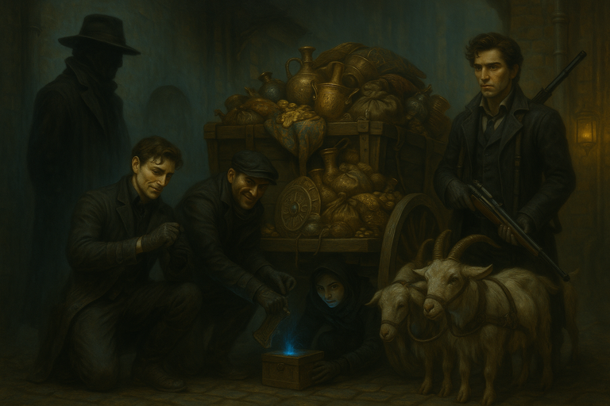
/// caption
All the loot the wagon can hold
///

- Signal [Ghostfang Pack](ghostfang-pack.md) that the bombs are about to go
    - {{ characters.hex.link }} and {{ characters.vesper.link }} stick around to make sure the [Ghostfang Pack](ghostfang-pack.md) gets out
    - they exit the building in a rush
    - one has a bloody nose
    - a small group of [Red Sashes](red-sashes.md) chase after them
    - the building gets obliterated

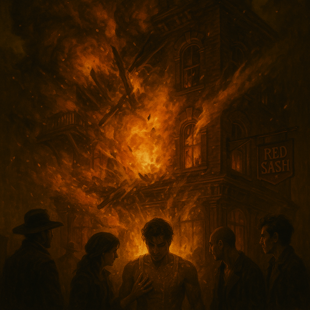
/// caption
The fiery demise of the [Red Sashes](red-sashes.md)' lair
///

- remaining [Red Sashes](red-sashes.md) stand up
    - leader [Myleraklev](myleraklev.md) is among them
    - `4` of the [Red Sashes](red-sashes.md) go after the [Ghostfang Pack](ghostfang-pack.md)

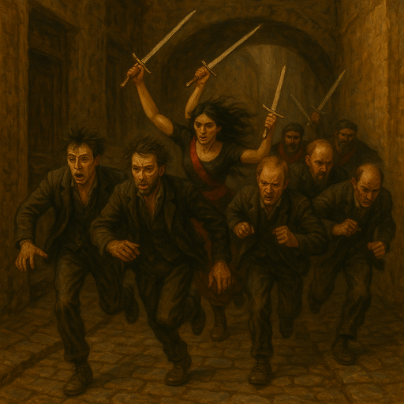
/// caption
The surviving [Red Sashes](red-sashes.md) chase the [Ghostfang Pack](ghostfang-pack.md)
///

- {{ characters.hex.link }} runs to a nearby sniping spot he prepared ahead of time
    - {{ characters.hex.link }} snipes at the leader
    - {{ d6_rolls([2, 4, 5, 3, 1]) }}
    - before she's hit, [Myleraklev](myleraklev.md) slices the arm of one of the [Ghostfang Pack](ghostfang-pack.md)

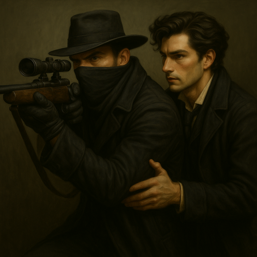
/// caption
{{ characters.hex.link }} snipes at [Myleraklev](myleraklev.md) and {{ characters.vesper.link }} spots
///

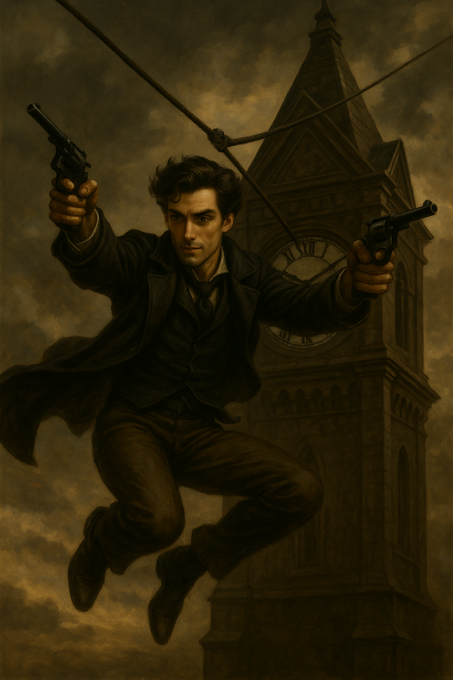
/// caption
{{ characters.vesper.link }} ziplines down to aid the [Ghostfang Pack](ghostfang-pack.md)
///

The [Red Sashes](red-sashes.md) wound another member of the [Ghostfang Pack](ghostfang-pack.md).

- {{ characters.vesper.link }} shoots [Myleraklev](myleraklev.md) in the back, destroying her armor
    - distracts her from attacking the [Ghostfang Pack](ghostfang-pack.md)

- {{ characters.hex.link }} takes another shot
    - pushes himself
    - {{ characters.jb.link }} assists
    - {{ d6_rolls([3, 6, 3, 5, 4]) }}
    - kills the leader [Myleraklev](myleraklev.md)
    - [Red Sashes](red-sashes.md) are temporarily stunned

- {{ characters.vesper.link }} tries to scare off the remaining [Red Sashes](red-sashes.md)
    - {{ characters.jackal.link }} inspires
    - {{ d6_rolls([4, 2, 5, 3, 4]) }}
    - {{ characters.vesper.link }} convinces [Red Sashes](red-sashes.md) to retreat

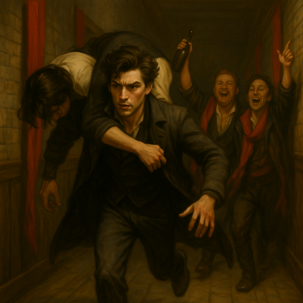
/// caption
{{ characters.vesper.link }} carries a wounded member of the [Ghostfang Pack](ghostfang-pack.md)
///

## Payoff

- crew earns {{ coin(55) }}
- crew earns {{ reputation(3) }} Reputation
    - {{ reputation(2) }} for successful score
    - {{ reputation(1) }} because higher tier
- add {{ heat(10) }} Heat
    - {{ heat(6) }} for wild
    - {{ heat(1) }} for high profile
    - {{ heat(1) }} for hostile turf
    - {{ heat(2) }} for killing involved
- {{ experience(0)}} Crew XP
- Faction status
    - Faction `+0`

## Entanglements

- {{ d6_rolls([3, 2]) }}
    - [Ghostfang Pack](ghostfang-pack.md) are injured
    - won't be available for clock of `4`

## Vices

Nobody overindulges.

## Downtime

faction upgrades

- {{ coin(10) }} carraige with war goats
- {{ coin(10) }} boat has armor and more cargo capacity
- {{ coin(10) }} vault upgrade
- {{ coin(10) }} lair security (spirit lamp that we could have stolen instead)

- {{ coin(15) }} remain, {{ coin(3) }} each

- {{ characters.echo.link }}
    - indulges view to reduce {{ stress(3) }}
    - looks for a long-term project for therapy to cure fear of alarms
    - {{ coin(1) }} to train prowess
- {{ characters.hex.link }}
    - relieve {{ stress(1) }}
    - {{ coin(1) }} relieve {{ stress(1) }}
    - train prowess
- {{ characters.jackal.link }}
    - reduces {{ heat(1) }}
    - reduces {{ heat(1) }}
    - {{ coin(1) }} to train prowess
- {{ characters.jb.link }}
    - starts a long-term project to investigate [Lady Freyla's](lady-freyla.md) death
        - completes {{ d6_rolls([2, 5], lowest=True) }} / `6` clock
    - visits [Dr. Finklebottom](finklebottom.md) for healing
- {{ characters.vesper.link }}
    - visits [Dr. Finklebottom](finklebottom.md) for healing
    - reduces {{ heat(1) }} by swaying opinions

Gain a new cohort, the [Dockfront Bruisers](dockfront-bruisers.md).

### Epilogue

The remaining [Red Sashes](red-sashes.md) gather the following day and vow to take revenge on us.

A few days later...

The remaining [Red Sashes](red-sashes.md) meet with [Inspectors](inspectors.md) in an inn.
One of the [Red Sashes](red-sashes.md) hands them detailed info on each member of [Bella's Boyz](bellas-boyz.md).
