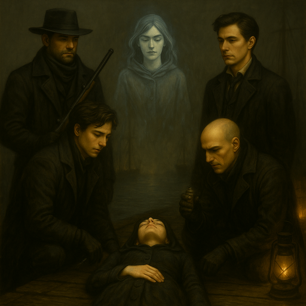
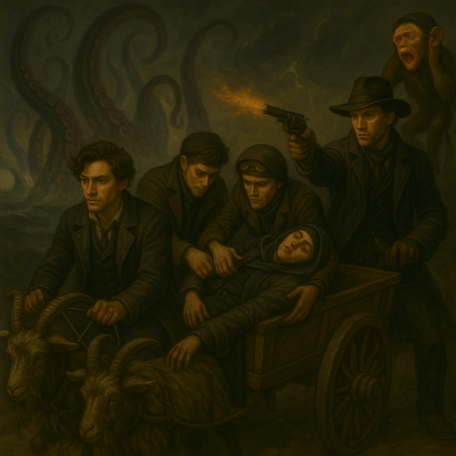

# A Massive Presence

{{ characters.jb.link }} wants to enter the spirit world.
There's a ritual that might work, but it will attract the attention of many spirits.
{{ characters.jb.link }} wants to learn about why spirits are lingering after death.

<!-- more -->

{{ characters.vesper.link }} suggests going down to the [Docks](docks.md).
{{ characters.hex.link }} takes up a sniper position for security (his and ours).
This ritual will change how {{ characters.jb.link }} thinks about the spirit world.

{{ characters.jb.link }} attunes to the ghost field.
{{ characters.jackal.link }} makes some **Quicksilver** to help.
It opens {{ characters.jb.link }}'s mind but causes a level 2 harm (zoned out).
{{ characters.vesper.link }} asks [Salia](salia.md) to watch over the ritual.

{{ d6_rolls([3, 2, 3, 6]) }}

We chose a spot where many deaths happened.
Small, blue electrical charges grow and shimmer across {{ characters.jb.link }}'s body.
The electricity stops and {{ characters.jb.link }}'s spirit is free.
{{ characters.jb.link }} senses a massive presence nearby.
Their consciousness stretches and becomes aware of more of the city.

/// caption
{{ characters.jb.link }}'s spirit is free
///

We notice the water level rise and the waves become choppier.
This is very unusual this far inland.
{{ characters.hex.link }} investigates through the sniper scope.
The enormous shape under the water could be a Leviathan.
Salia thinks the energy of the ritual attracted it.
The leviathan is coming towards us.

{{ characters.jackal.link }} and {{ characters.echo.link }} carry {{ characters.jb.link }}'s body to the wagon.
{{ characters.hex.link }} runs down from his sniper position.
Tentacles spring from the water.
{{ characters.jb.link }} is experiencing everything, everywhere, all at once.

Tommy Butts ({{ characters.hex.link }}'s pet hunting monkey) puts its fingers to its temples to make a mind link with the leviathan.
The tentacles destroy a nearby building.
The monkey shrieks and the tentacles stop for a moment.

{{ characters.vesper.link }} drives the carraige, with {{ characters.echo.link }} navigating.
{{ d6_rolls([1, 6, 3, 1, 3, 1]) }} - we outrun the tentacles, but several buildings are destroyed.
{{ characters.jb.link }} regains consciousness.
The Leviathan fades away.
As we ride away in the wagon, we hear crows shrieking, announcing the dead.

/// caption
[Bella's Boyz](bellas-boyz.md) escape, with {{ characters.jb.link }} injured
///

{{ characters.jb.link }} gains a lot of knowledge about the spirit world.
Chief inspector is cheating on his wife with the second in command of the [Red Sashes](red-sashes.md).
