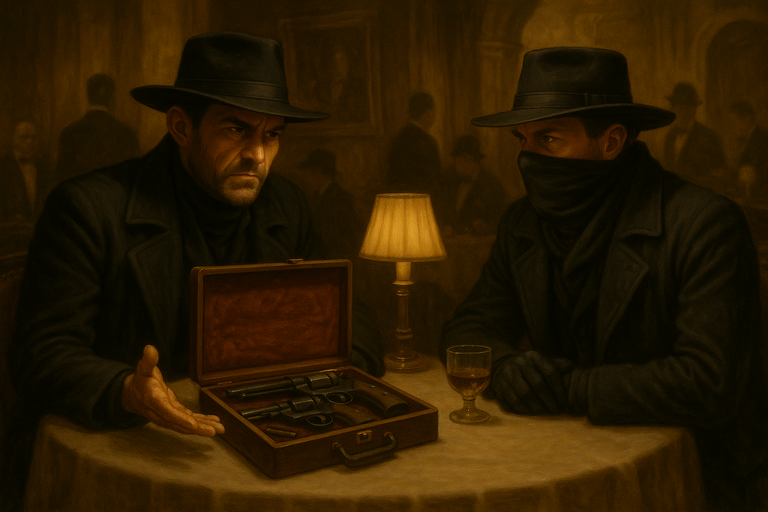
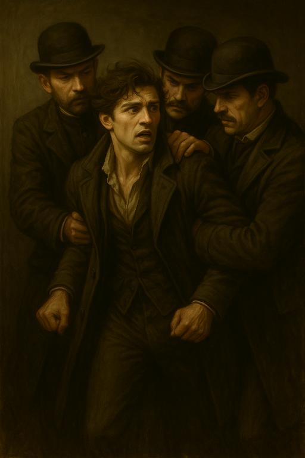
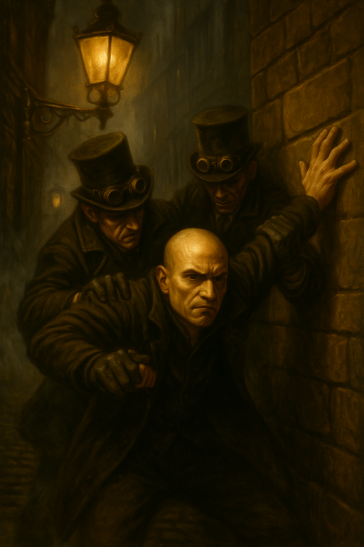
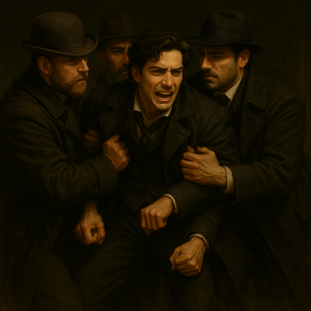
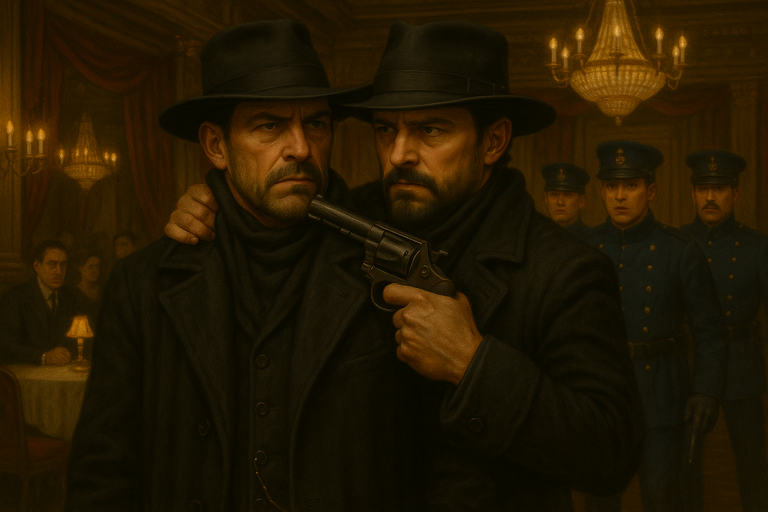
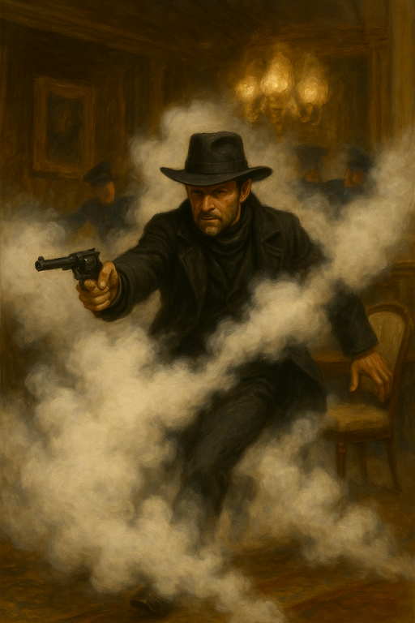

# Gex Vexes Hex

{{ characters.hex.link }} goes to Da Club and orders a glass of **Goose Monde**, an expensive wine.
Later, {{ characters.hex.link }}'s brother [Gex](gex.md) walks up to the bar and and orders.

<!-- more -->

- {{ characters.hex.link }} goes over to talk to [Gex](gex.md)
    - {{ characters.hex.link }}: "How's Mother? Seeing as how the two of you abandoned me"
    - [Gex](gex.md): "You abandoned us! For your guns..."
    - {{ characters.hex.link }}: "That's not how I remember it"
    - [Gex](gex.md): "You cared more about your reputation"
    - {{ characters.hex.link }}: "What are you doing"
    - [Gex](gex.md): "Getting revenge on you"
    - {{ characters.hex.link }}: "Why?"
    - [Gex](gex.md): "To get mother's approval. She's always focused on you."
    - {{ characters.hex.link }}: "How are you going to do that?"
    - [Gex](gex.md): "By taking everything you care about away from you"
    - {{ characters.hex.link }}: "Where did you get my guns?"
    - [Gex](gex.md): "Your crew, and all of your possessions, are being rounded up by the [Inspectors](inspectors.md)"
    - {{ characters.hex.link }}: "Taking my guns won't capture me"

/// caption
[Gex](gex.md) has {{ characters.hex.link }}'s guns
///

Some [Inspectors](inspectors.md) show up, but {{ characters.hex.link }} has been bribing them for awhile.
2 more show up, but {{ characters.hex.link }} has paid them off as well.
All over the city, [Inspectors](inspectors.md) come after [Bella's Boyz](bellas-boyz.md).

<table markdown>
<tr markdown>
<td markdown></td>
<td markdown></td>
<td markdown></td>
</tr>
</table>
/// caption
{{ characters.echo.link }}, {{ characters.jackal.link }}, and {{ characters.vesper.link }} are captured by the [Inspectors](inspectors.md)
///

[Gex](gex.md) reads a list of our crimes.
{{ characters.hex.link }} picks up his gun, grabs his brother, and "escorts" him out of Da Club.

/// caption
{{ characters.hex.link }} escorts [Gex](gex.md) out
///

- [Gex](gex.md): "You can pull the trigger. Nothing would make me happier than to ruin you in mother's eyes."
- {{ characters.hex.link }}: "I won't pull the trigger, because I love you too damn much. I'm going to figure out what happened."
- {{ characters.hex.link }} whacks his brother on the head to give him time to escape.
- {{ characters.hex.link }} presses a button to trigger smoke bombs and escape.

/// caption
{{ characters.hex.link }} vanishes in smoke
///

{{ characters.jb.link }}'s ritual made them aware the [Inspectors](inspectors.md) approaching while in spirit form and was able to escape.

{{ characters.echo.link }}, {{ characters.jackal.link }}, and {{ characters.vesper.link }} are in prison.
{{ characters.hex.link }} and {{ characters.jb.link }} wait to see if anyone returns to the hideout.
The rest of us are processed in prison.
A death penalty seems possible.
