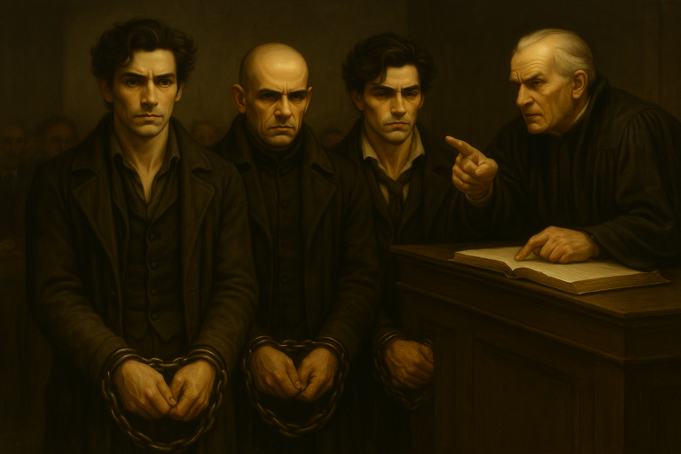
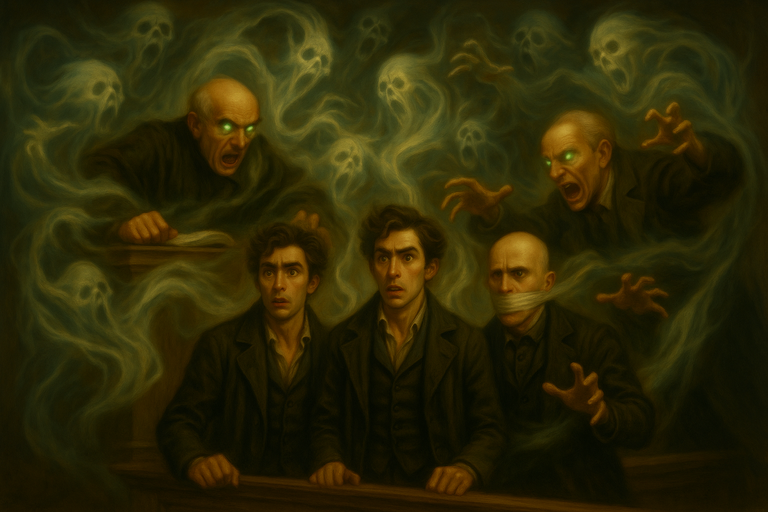

# 2025-06-24 Possession is the Law

{{ characters.echo.link }}, {{ characters.jackal.link }}, and {{ characters.vesper.link }} are in prison.
The death penalty seems possible.

<!-- more -->

## Plan

- **Plan:** Occult
- **Detail:** we'll try to possess the judge
- **Engagement Roll:** {{ d6_rolls([5, 5]) }}

## Score

- [Nyryx](nyryx.md) has some intel on the judge

/// caption
{{ characters.vesper.link }} consults [Nyryx](nyryx.md)
///

- it's all going down on arraignment day
- {{ characters.jb.link }} and {{ characters.hex.link }} are disguised as blue coats
    - {{ d6_rolls([2, 2, 6, 6, 5]) }}
    - enter the courtroom without being noticed

/// caption
{{ characters.echo.link }}, {{ characters.jackal.link }}, and {{ characters.vesper.link }} in court
///

- Judge reads the list of charges
    - "What do you have to say for yourselves?"
    - {{ characters.vesper.link }} blames Rolan Watt for everything
    - {{ characters.echo.link }} cites some case laws to reinforce his points
    - {{ d6_rolls([2, 2, 6, 6, 5]) }}
- The judge says we made some good points
    - "Guess I'm going to have to let you go"
    - Prosecutor: "we're ready for your methods of persuasion. Gag that Man!"
- Prosecutor approaches the bench and converses with the judge
    - The judge seems to snap out of a trance
    - "Where was I? Oh, right! Sentencing you... To Death!"
- {{ characters.echo.link }} gives a monologue about the judge's unfairness
    - so many others have been wronged by the same judge
    - calls up any spirits unfairly sentenced to come into the courtroom
- {{ characters.vesper.link }} attunes to the ghost field
    - {{ d6_rolls([6, 5, 6 ,2]) }}

/// caption
Spirits swarm the courtroom
///

- Ghosts enter the courtroom and possess people
    - Manacles are unlocked
- {{ characters.jb.link }} takes all of us through the wall using the ghost field.
- We see the [Dockfront Bruisers](dockfront-bruisers.md) protesting out front as we leave

## Payoff

- crew earns {{ coin(0) }}
- crew earns {{ reputation(4) }} Reputation
- add {{ heat(1) }} Heat
- {{ experience(0)}} Crew XP
- Faction status
    - Faction `+0`

## Entanglements

- {{ d6_rolls([2, 2], lowest=True) }}
- [Nyryx](nyryx.md) gets taken into custody
    - not available next session

## Vices

- {{ characters.jackal.link }} overindulges
    - brags about our accomplishments {{ heat(2) }} at a bar

## Downtime

- mastery {{ coin(10) }}
    - {{ coin(6) }} coffers
    - {{ coin(2) }} {{ characters.hex.link }}
    - {{ coin(2) }} {{ characters.vesper.link }}

- {{ characters.echo.link }}
    - reduces {{ stress(3) }}
    - sees a therapist about fear of alarms
    - {{ coin(1) }} continues talking to therapist and makes a breakthrough
- {{ characters.hex.link }}
    - reduces {{ stress(2) }}
    - reduces {{ heat(1) }}
        - bribes the bluecoats that [Gex](gex.md) bribed {{ d6_rolls([2, 3, 2]) }}
- {{ characters.jackal.link }}
    - reduces {{ heat(1) }} by issuing a retraction at the pub
    - reduces {{ heat(1) }} by issuing a retraction at a different pub
- {{ characters.jb.link }}
    - sees [Dr. Finklebottom](finklebottom.md) to cure effects of **Quicksilver**
    - again
    - and again
    - reduced to level `1` harm
- {{ characters.vesper.link }}
    - tries to get [Nyryx](nyryx.md) out of jail {{ d6_rolls([5, 5, 2, 5]) }} makes progress
    - tries again {{ d6_rolls([5, 2, 6, 1]) }} she's free

## Epilogue

A woman walks into [Rolan Wott](rolan-wott.md)'s office.
"Honey, it's time for dinner!"
It's {{ characters.hex.link }}'s mom...
