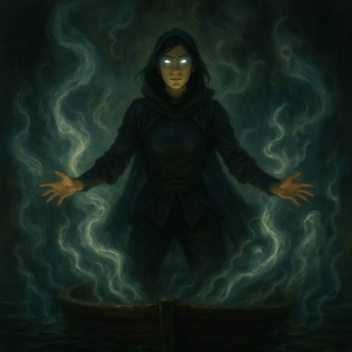

# The Final Countdown

[Bella's Boyz](bellas-boyz.md) try to fulfill {{ characters.jackal.link }}'s dream to overthrow the government.
Bringing down the barrier will let all of the vengeful spirits in.
Taking out the bridge to keep everyone in [Whitecrown](whitecrown.md) should ensure their demise.
It's a bold plan, can they pull it off?

<!-- more -->

## Plan

[Bella's Boyz](bellas-boyz.md) will bring down the barrier to let all of the spirits in.
{{ characters.jb.link }} will make sure the spirits stay in [Whitecrown](whitecrown.md).
The [Crows](crows.md) lend us a gang of thugs to take out the bridge, blocking people from escaping [Whitecrown](whitecrown.md).
{{ characters.vesper.link }} gets drugs to help the [Ghostfang Pack](ghostfang-pack.md) recover.
The [Ghostfang Pack](ghostfang-pack.md) make sure that all the government officials attend a party in [Whitecrown](whitecrown.md) at the governor's stronghold.
Meanwhile, the [Dockfront Bruisers](dockfront-bruisers.md) watch the river to make sure nobody swims out.

- **Plan:** **Assault**
- **Detail:** See above
- **Engagement Roll:** {{ d6_rolls([5, 2, 2]) }}
    - `+1` bold or daring
    - `+1` something
    - `+1` contacts are helping
    - `-1` higher tier target

## Score

[Bella's Boyz](bellas-boyz.md) prepare.

/// caption
{{ characters.jackal.link }} makes explosives
///

/// caption
{{ characters.hex.link }} oils his gun
///

/// caption
{{ characters.vesper.link }} visits [Nyryx](nyryx.md)
///

/// caption
{{ characters.echo.link }} gambles away his anxiety
///

- [Bella's Boyz](bellas-boyz.md) pull up on the shore and begin unloading bombs
- [Dockfront Bruisers](dockfront-bruisers.md) help set up
- {{ characters.jackal.link }} will need to supervise detonations

/// caption
{{ characters.jackal.link }} works on the barrier explosives
///

/// caption
{{ characters.hex.link }} is on overwatch in the lighthouse
///

- {{ characters.hex.link }} whistles that a patrol is coming
    - `4` guards
- {{ characters.vesper.link }} and {{ characters.echo.link }} disguise themselves as maintenance crew
- {{ characters.vesper.link }} talks to the guards
    - guards say there's a lot of security tonight
- {{ characters.echo.link }} hands them a forged work order
    - guards wish us well and depart

/// caption
{{ characters.vesper.link }} and {{ characters.echo.link }} convince the patrol that we're doing maintenance on the barrier
///

- {{ characters.hex.link }} sees [Gex](gex.md), his mother, and [Rolan Wott](rolan-wott.md) walk into the party

/// caption
[Rolan Wott](rolan-wott.md), [Gex](gex.md), and his mother arrive
///

- {{ characters.hex.link }} notices the stronghold shimmering with its own spirit field
    - somehow manages to signal us
- {{ characters.echo.link }} prepared forged invitations ahead of time
    - {{ characters.jb.link }} was able to describe the invitation
    - {{ characters.echo.link }} made 5 copies

/// caption
{{ characters.echo.link }} forges invitations from {{ characters.jb.link }}'s description
///

- {{ characters.echo.link }}, {{ characters.vesper.link }}, and {{ characters.jackal.link }} dress up and sneak into the party
    - approach the gates
    - there are several guards outside
    - as we enter, the guards flip a switch to disarm and re-arm the ghost field
- {{ characters.vesper.link }} asks about the switch
    - wants to make sure we're safe at the party
    - {{ d6_rolls([5, 3, 3, 2, 4]) }}
    - guard says the system was installed before the current government
    - it's a backup in case the barrier goes down
    - maintained at a secure central station
    - {{ characters.vesper.link }} says he's interested in seeing it
    - guard tells us to talk to someone and say **Sammy** sent us
- enter a huge ballroom
    - hundreds of people inside
    - high society in full swing
    - waiters, food, and drink everywhere

/// caption
{{ characters.vesper.link }}, {{ characters.jackal.link }}, and {{ characters.echo.link }} enter the ballroom
///

- find the guard and mention **Sammy** sent us
    - go downstairs and down a hallway
    - approach an iron door with 2 guards
    - central station is behind the door
    - a couple more guards on the inside
    - lock looks pretty secure
- {{ characters.vesper.link }} tries to sway a guard that one of the guests has a weapon
    - {{ characters.echo.link }} assists by confirming
    - {{ d6_rolls([6, 3, 3, 3, 4, 2]) }}
    - some of the guards leave to investigate the weapon
- we go back to the door
    - we're pressed for time
- {{ characters.jackal.link }} uses tinkering tools to get in
    - {{ d6_rolls([6, 3, 3, 3, 4, 2]) }}
    - we open the door a crack
    - {{ characters.echo.link }} tosses in a vial of slumber essence
    - we close the door
    - hear some coughing and 2 bodies thump to the ground
- we open up the door and go in
    - close it behind us
    - {{ characters.vesper.link }} ties up and gags the guards
    - the device is complicated and would take a long time to disable
    - we find the power source
    - small metal box with a blue crystal floating inside

/// caption
{{ characters.jackal.link }}, {{ characters.echo.link }}, and {{ characters.vesper.link }} discover the spirit field's power source
///

- {{ characters.jackal.link }} tries to break open the power supply box
    - {{ characters.vesper.link }} assists
    - {{ d6_rolls([2, 2, 2, 6, 4, 6]) }}
    - {{ characters.vesper.link }} holds a wedge, picking just the right spot
    - {{ characters.jackal.link }} hits it with a sledge
    - metal splits just enough to grab the crystal

/// caption
{{ characters.jackal.link }} and {{ characters.vesper.link }} prepare to break open the power supply
///

- {{ characters.echo.link }} takes the crystal
    - a small amount of gas leaks out
    - the machine turns off

/// caption
{{ characters.echo.link }} removes the crystal
///

- we open the door
    - head upstairs
    - guards are stripping down the man we accused of having a weapon
    - as we leave, the guards flip the switch to temporarily disable the spirit field
    - somehow, the guards don't notice the field was already off
- shortly after we exit, [Rolan Wott](rolan-wott.md) walks out with `3` guards

/// caption
[Rolan Wott](rolan-wott.md) leaves the party
///

- {{ characters.hex.link }} takes aim at [Rolan Wott](rolan-wott.md)
    - {{ characters.echo.link }} drops a note
    - [Rolan Wott](rolan-wott.md) stops to pick it up and reads "These are the last words you'll ever read"
    - {{ characters.hex.link }} takes the shot
    - {{ d6_rolls([6, 6, 6, 2, 2]) }}
    - the note is splattered with blood
    - [Rolan Wott](rolan-wott.md) drops to the ground
    - guards sound the alarm

<table markdown>
<tr markdown>
<td markdown></td>
<td markdown></td>
<td markdown></td>
</tr>
</table>
/// caption
{{ characters.hex.link }} takes aim at and fires at [Rolan Wott](rolan-wott.md), who stopped to pick up {{ characters.echo.link }}'s note
///

- we split up and head for the barrier pylon bomb locations
    - {{ characters.jackal.link }} heads for furthest
    - {{ characters.vesper.link }} next
    - {{ characters.echo.link }} next
    - {{ characters.hex.link }} at lighthouse
- first barrier support blows

/// caption
{{ characters.jackal.link }} expertly detonates the first barrier pylon
///

- people are scattering
- {{ characters.vesper.link }} gets to his barrier pillar just after the first one blows
    - takes a moment to psych himself up first
    - {{ d6_rolls([3, 3, 6, 4]) }}
    - connects wires just as {{ characters.jackal.link }} showed him
    - uses timer appropriately but just barely gets away

<table markdown>
<tr markdown>
<td markdown></td>
<td markdown></td>
</tr>
</table>
/// caption
{{ characters.vesper.link }} psychs himself up and detonates the second barrier pylon, escaping the blast only slightly singed
///

- {{ characters.echo.link }} gets to the second barrier bomb
    - tries to give himself more time by shooting the timing mechanism
    - {{ d6_rolls([1, 1, 4]) }}
    - he's distracted by remembering {{ characters.vesper.link }}'s words of encouragement
    - too slow getting away
    - explosion goes off early
    - would have been a level 2 harm, but {{ characters.echo.link }} resists
    - takes a level 1 harm instead - bruised rib

<table markdown>
<tr markdown>
<td markdown></td>
<td markdown></td>
</tr>
</table>
/// caption
{{ characters.echo.link }} detonates the third barrier pylon, distracted by {{ characters.vesper.link }}'s words of encouragement, and is slammed into the ground by the blast
///

- {{ characters.hex.link }} goes to the last barrier pylon
- [Gex](gex.md) and his mother step out
    - gun pointed at his own mother

/// caption
[Gex](gex.md) takes his own mother hostage
///

- [Gex](gex.md): "I knew you would try something like this. Get us off this island with you."
    - {{ characters.hex.link }}: "Give me your gun"
    - Mother: "Do it, trust him"
- {{ characters.hex.link }} tries to snatch the gun
    - {{ d6_rolls([4, 1, 3, 6, 2, 4]) }}
    - {{ characters.hex.link }} takes the gun
    - [Gex](gex.md) seems shocked
    - {{ characters.hex.link }}: Of course I'm not going to trust you, you're pointing a gun at Mom!
    - [Gex](gex.md): I thought you were going to shoot me
    - {{ characters.hex.link }}: I'm not going to shoot you, you're my brother! Now follow me, let's get off this island!

/// caption
{{ characters.hex.link }} snatches the gun from [Gex](gex.md)
///

- {{ characters.jackal.link }} sets off the last bomb
    - just barely leaps onto the boat

/// caption
{{ characters.jackal.link }} leaps away from the final blast onto the boat
///

- as we leave, we see the water rise and tentacles appear
    - tentacles are swinging through buildings

<table markdown>
<tr markdown>
<td markdown></td>
<td markdown></td>
</tr>
</table>
/// caption
{{ characters.jb.link }} guides the spirits as they rampage through [Whitecrown](whitecrown.md)
///

<video controls>
<source src="../../../../2025-07-09-the-final-countdown/spirits-rampage.mp4" type="video/mp4">
</video>

- one of the [Crows](crows.md) sends a signal
    - the bridge explodes and collapses into the water
- {{ characters.jb.link }} collapses from exertion
    - tentacles recede into the water
    - we feel spiritual energy dissapate

## Eplilogue

- {{ characters.jb.link }} stays in a coma
- The [Crows](crows.md) become the new government
    - unite the upper class and the working class
    - people rally around them
- blackmailer stops contacting {{ characters.echo.link }}
    - might be getting more from another source?
- [Gex](gex.md) reveals a second gun
    - [Gex](gex.md): "I could have pulled this any time, but I love you too brother"
- Mother embraces {{ characters.hex.link }}
    - {{ characters.hex.link }}: Sorry about [Rolan](rolan-wott.md)
    - Mother: I was just using him to get by
- [Gex](gex.md) killed [Lady Freyla](lady-freyla.md) to frame us
- [Rolan Wott](rolan-wott.md)'s daughter wants revenge...
